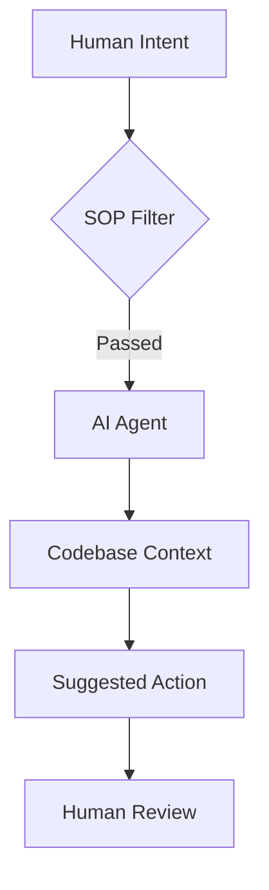

# RAK-01: Anatomy & Landscape

> [!NOTE]
> This documentation follows the **PPM V4 Gold Standard**.

## 🔗 1. Source Link
- [Cursor Official Documentation](https://cursor.sh/how-to-use)
- [Agentic Workflow Concepts (Anthropic)](https://www.anthropic.com/research/building-effective-agents)

## 📖 2. Brief & Detailed Explanation
### Brief
Mengenal anatomi asisten AI dan lanskap workflow koding berbasis agen dalam IDE modern.

### Detailed
Pembahasan mendalam tentang sejarah AI Coding, evolusi dari autocomplete sederhana hingga agen otonom, serta bagaimana IDE seperti Cursor mengintegrasikan konteks basis kode ke dalam model bahasa besar (LLM).

## 💡 3. Analogy
Membayangkan asisten AI sebagai seorang magang yang sangat cepat membaca dokumen namun membutuhkan arahan (SOP) yang jelas agar tidak melakukan kesalahan fatal saat bekerja di gudang (codebase) yang besar.

## 📊 4. Mermaid Diagram

## ⚙️ 5. Under-the-hood Mechanics
Menjelaskan bagaimana indexing (RAG - Retrieval Augmented Generation) bekerja di balik layar Cursor untuk memberikan konteks yang relevan kepada AI.

## 🏛️ 8. Granular Structure (The Taxonomy)

### [SR-01: History & Evolution](./SR-01-History-Evolution/)
- [BK-01: From Autocomplete to Agents](./SR-01-History-Evolution/BK-01-From-Autocomplete-to-Agents.md)

### [SR-02: Agentic Concepts](./SR-02-Agentic-Concepts/)
- [BK-01: What is an Agent?](./SR-02-Agentic-Concepts/BK-01-What-is-an-Agent.md)
- [BK-02: Tool Use and Reasoning](./SR-02-Agentic-Concepts/BK-02-Tool-Use-and-Reasoning.md)

### [SR-03: IDE Architecture](./SR-03-IDE-Architecture/)
- [BK-01: Cursor Internal Anatomy](./SR-03-IDE-Architecture/BK-01-Cursor-Internal-Anatomy.md)

---

> [!TIP]
> Mulailah dari **SR-01** untuk memahami mengapa kita berada di era ini, lalu lanjutkan ke **SR-03** untuk memahami bagaimana mesin yang Anda gunakan saat ini (Cursor) bekerja di balik layar.
