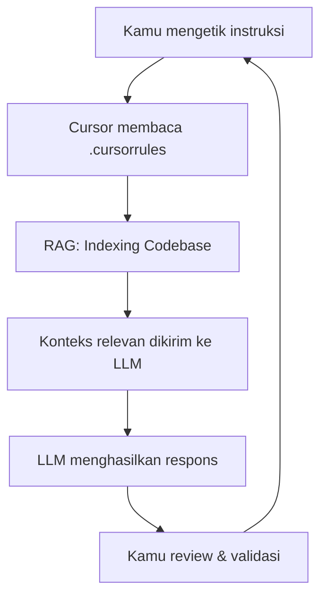

# RAK-01: Anatomy & Landscape — Mengenal AI dari Dalam

## 🌟 Gampangnya...

Dulu, AI itu cuma tukang auto-complete — dia hanya menebak kata berikutnya seperti keyboard HP. Sekarang, AI sudah jadi **partner diskusi** yang bisa membaca seluruh codebase-mu, mengerti konteks proyekmu, dan memberikan saran arsitektural level senior. RAK ini menjelaskan perjalanan itu dan memperkenalkanmu pada cara kerja AI yang kamu pakai setiap hari.

---

## 📖 Konteks & Sejarah

### Evolusi AI Coding dalam 3 Era

| Era | Teknologi | Kemampuan |
|---|---|---|
| **Era 1: Autocomplete** (2010–2019) | IntelliSense, TabNine | Menebak kata/baris berikutnya |
| **Era 2: Code Generation** (2020–2022) | GitHub Copilot (GPT-3) | Generate fungsi dari komentar |
| **Era 3: Agentic AI** (2023–kini) | Cursor, Gemini, Claude | Membaca konteks, diskusi, refactor, debug |

AI sekarang mengenal **seluruh strukturmu** — bukan hanya satu file. Ini yang membuatnya bisa menjadi *partner* bukan sekadar *typewriter*.

---

## ⚙️ Cara Kerja

### Bagaimana AI Memahami Proyekmu



**RAG (Retrieval Augmented Generation)** = Mekanisme di mana AI tidak hanya mengandalkan memorinya, tapi aktif *mengambil* potongan kode relevan dari proyekmu dan memasukkannya ke dalam jendela konteks sebelum menjawab.

> **Analogi**: AI seperti magang baru yang sangat cepat membaca dokumen. Sebelum menjawab pertanyaanmu, ia lari ke rak arsip dulu, ambil file yang relevan, baca sekilas, baru menjawab dengan percaya diri.

---

## 🗺️ Kapan Mode Ini Relevan

| Mode | Kapan Pakai di Konteks Ini |
|---|---|
| 🗣️ **DISCUSS** | "Jelaskan bagaimana AI memahami proyekku" |
| 🔬 **ANALYZE** | "Cek file apa saja yang AI kamu baca untuk memahami tugas ini?" |
| 📐 **BLUEPRINT** | "Bantu saya rancang struktur folder yang mudah dibaca AI" |

---

## 🛠️ Cara Pakai

### Ritual Awal Sesi (Wajib Dilakukan)

```
"Sebelum mulai, baca struktur folder proyekku dan jelaskan 
 dalam 3 kalimat: apa yang sudah kamu pahami?"
```

### Memastikan AI Tidak "Menebak"

```
"File apa saja yang kamu baca untuk memahami tugas ini? 
 Sebutkan path-nya."
```

### Melacak Evolusi Cara Kerja AI

```
"Bagaimana cara yang lebih modern untuk mengerjakan [task X] 
 dibandingkan cara lama yang biasa dipakai?"
```

---

## 🧪 Lab Praktek

**Skenario: Memulai proyek baru bersama AI**

1. Buka chat Cursor di root proyek baru.
2. Ketik: *"Saya baru mulai proyek [nama proyek]. Ini adalah [deskripsi singkat]. Baca semua file yang ada dan jelaskan pemahamanmu tentang arsitektur yang akan kita bangun."*
3. AI akan mendeskripsikan strukturnya — **jika tidak akurat, koreksi sekarang** sebelum lanjut.
4. Ketik: *"Baik. Sekarang kita masuk ke fase BLUEPRINT. Jangan coding dulu."*

---

## ⚠️ Jebakan & Solusi

| Jebakan | Gejala | Solusi |
|---|---|---|
| **Konteks kosong** | AI menjawab generik, tidak spesifik proyekmu | Selalu buka proyekmu di Cursor sebelum chat |
| **Terlalu percaya AI** | AI bilang "oke" tapi hasilnya salah total | Selalu tanya "file apa yang kamu baca?" |
| **Era mismatch** | AI pakai cara lama yang sudah deprecated | Tanyakan: "Ada cara yang lebih modern?" |

---

### 🗂️ Sub-Rak & Buku
- **SR-01: History & Evolution**
  - BK-01: From Autocomplete to Agents
- **SR-02: Agentic Concepts**
  - BK-01: What is an Agent?
  - BK-02: Tool Use and Reasoning
- **SR-03: IDE Architecture**
  - BK-01: Cursor Internal Anatomy (RAG, Context Window, Indexing)
