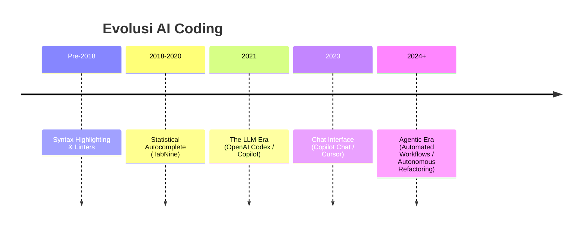

# BK-01: From Autocomplete to Agents

> [!NOTE]
> This documentation follows the **PPM V4 Gold Standard**.

## 🔗 1. Source Link
- [The History of AI Coding (OpenAI)](https://openai.com/blog/openai-codex)
- [Evolusi GitHub Copilot](https://github.blog/2023-03-22-github-copilot-x-the-ai-powered-developer-experience/)

## 📖 2. Brief & Detailed Explanation
### Brief
Memahami garis waktu perkembangan AI dalam penulisan kode: dari suggester pasif hingga kolaborator aktif.

### Detailed
Perjalanan ini dimulai dari **IntelliSense** (pattern matching sederhana), lalu **TabNine** (deep learning pertama di IDE), hingga ledakan **Large Language Models (LLM)** dengan OpenAI Codex. Puncaknya adalah pergeseran dari **Copilot** (yang hanya menunggu perintah) ke **Agentic AI** (yang mampu merencanakan dan mengeksekusi langkah-langkah kompleks secara mandiri).

## 💡 3. Analogy
**Autocomplete** adalah seperti kamus prediktif pada ponsel; ia hanya menebak kata berikutnya. **Agentic AI** adalah seperti asisten eksekutif; Anda memberinya tujuan ("Buat aplikasi cuaca"), dan ia yang mengatur logistik, riset API, hingga penulisan kodenya.

## 📊 4. Mermaid Diagram

## ⚙️ 5. Under-the-hood Mechanics
Bagaimana transisi dari *Token Prediction* (memprediksi kata berikutnya) ke *Reasoning Chains* (merencanakan alur kerja sebelum menulis token pertama).

## 🧪 6. Practical Lab
Perbandingan kecepatan antara ngetik manual vs tab-autocomplete vs agentic generation di `./examples/01-speed-comparison.md`.

## ⚠️ 7. Pitfalls & Anti-Patterns
- **The Stagnation Trap**: Masih menggunakan AI hanya sebagai pelengkap baris kode, bukan sebagai mitra desain sistem.
- **Over-reliance on Predictors**: Mengasumsikan bahwa tebakan otomatis selalu benar secara logika bisnis.
