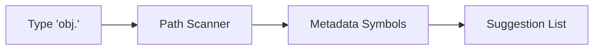

# CH-01: The IntelliSense Era

## 📖 1. Context & Background
Sebelum AI, pengembang begantung pada **Static Analysis**. IntelliSense yang diperkenalkan Microsoft pada tahun 1996 adalah revolusi pertama. Sistem ini bekerja dengan membaca metadata dari library yang Anda gunakan dan menampilkan daftar method yang tersedia.

## ⚙️ 2. Mechanics: How it Worked
- **Trie Data Structures**: Untuk pencarian cepat nama fungsi.
- **Reflection & Introspection**: Membaca struktur kelas saat runtime/compile-time.
- **Zero Reasoning**: Tidak ada pemahaman konteks; hanya mencocokkan karakter yang Anda ketik dengan daftar simbol.

## 📊 3. Workflow Flowchart

## ⚠️ 4. Limitations
- Sangat kaku.
- Tidak bisa membantu menulis logika bisnis.
- Membutuhkan definisi tipe data yang sangat eksplisit.
