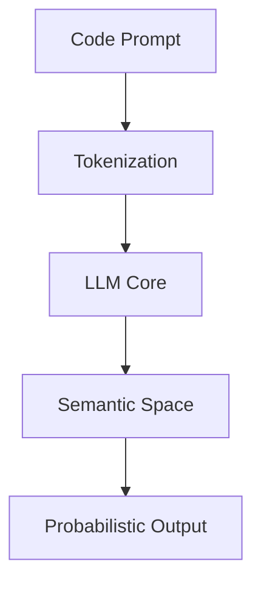

# CH-02: The LLM Revolution

## 📖 1. Context: 2020 - 2023
Era ini dimulai dengan **GPT-3** dan **OpenAI Codex**. Perbedaan mendasarnya adalah AI tidak lagi membaca metadata, melainkan "membaca" jutaan baris kode dari GitHub untuk memahami pola penulisan manusia.

## ⚙️ 2. Mechanics: Probabilistic Generation
- **Next Token Prediction**: AI menebak baris kode berikutnya berdasarkan probabilitas statistik.
- **In-Context Learning**: Kemampuan model untuk mengikuti instruksi di dalam prompt (Zero-shot/Few-shot).
- **Transformer Architecture**: Penggunaan mekanisme *Attention* untuk memahami hubungan antara variabel di awal file dengan kode di akhir file.

## 📊 3. Architecture Overview

## ⚠️ 4. The "Copilot" Paradigm
Pada tahap ini, AI masih bersifat **reaktif**. Ia menunggu kursor Anda berhenti atau Anda menekan tombol shortcut. Masalah utama: AI sering melakukan halusinasi pada library yang tidak ada.
