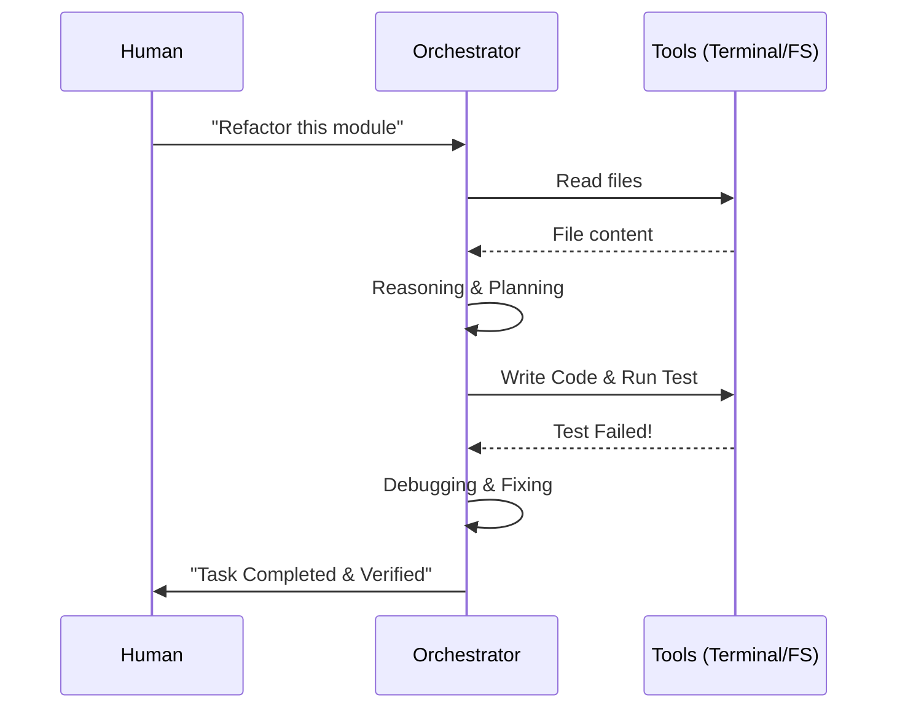

# CH-03: Agentic Workflows 2024+

## 📖 1. Context: The Present & Future
Kita berada di era di mana AI tidak lagi hanya "mengisi kata", tapi **menjalankan tugas**. Alat seperti Cursor (Composer), Devin, dan OpenDevin adalah pelopor di mana AI diberikan akses ke file system, terminal, dan browser.

## ⚙️ 2. Mechanics: Plan-and-Execute
- **Reasoning Engines**: AI membuat rencana (Blueprint) sebelum menulis kode.
- **Tool Use**: Kemampuan memanggil fungsi eksternal (search, run command, read doc).
- **Self-Correction Loop**: Jika ada error saat kompilasi, AI mendeteksi pesan error dan mencoba memperbaikinya secara otonom.

## 📊 4. Agentic Interaction Model

## 🚀 3. Implications
Pengembang bergeser perannya dari **"Penulis Kode"** (Coder) menjadi **"Peninjau Kode"** (Reviewer) dan **"Arsitek Sistem"** (Orchestrator).
