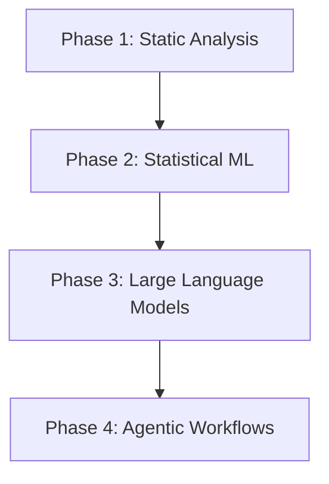

# BK-01: From Autocomplete to Agents (Overview)

> [!NOTE]
> This documentation follows the **PPM V4 Gold Standard**.

## 🔗 1. Source Link
- [The History of AI Coding (OpenAI)](https://openai.com/blog/openai-codex)
- [Evolution of GitHub Copilot](https://github.blog/2023-03-22-github-copilot-x-the-ai-powered-developer-experience/)

## 📖 2. Brief & Detailed Explanation
### Brief
Memahami garis waktu perkembangan AI dalam penulisan kode: dari suggester pasif hingga kolaborator aktif.

### Detailed
Pencarian teknis ini membedah bagaimana kita berpindah dari era **IntelliSense** (pattern matching) ke era **Agentic AI**. Buku ini terbagi menjadi 3 bab utama yang membahas transisi teknologi dari prediksi token sederhana hingga rantai penalaran kompleks yang memungkinkan AI bertindak sebagai agen otonom.

## 💡 3. Analogy
Membayangkan evolusi AI seperti evolusi transportasi: dari **Sepeda** (Autocomplete - butuh tenaga penuh), ke **Mobil Otomatis** (Copilot - Anda masih di setir), hingga **Private Jet dengan Pilot** (Agentic AI - Anda hanya menentukan tujuan).

## 📊 4. Mermaid Diagram

## 📐 9. Chapter List (The Deep Dive)
1. [CH-01: The IntelliSense Era](./CH-01-The-Intellisense-Era.md)
2. [CH-02: The LLM Revolution (2020-2023)](./CH-02-The-LLM-Revolution.md)
3. [CH-03: Agentic Workflows 2024+](./CH-03-Agentic-Workflows-2024.md)

---

> [!IMPORTANT]
> Memahami sejarah akan membantu Anda memprediksi ke mana arah teknologi ini selanjutnya.
