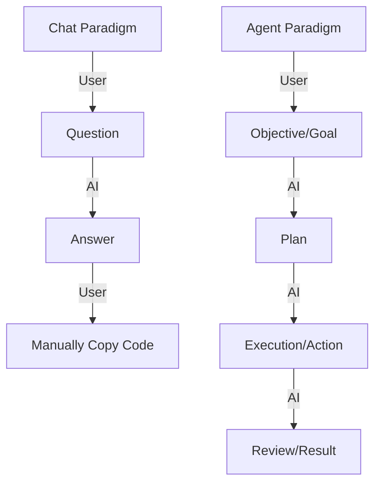

# BK-01: History of Agents — Evolusi dari Chatbot ke Partner Otonom

## 🌟 Gampangnya...

Dulu, AI itu seperti mesin pencari yang bisa diajak ngobrol — kamu tanya, dia jawab (Chatbot). Sekarang, AI sudah berubah menjadi **Agent**. Perbedaannya? Chatbot hanya "tahu", tapi Agent bisa "melakukan". Agent bisa membuka file, menjalankan terminal, dan memperbaiki bug-mu sendiri. Memahami sejarah ini penting agar kamu tahu bahwa AI sekarang bukan cuma buat ditanya, tapi buat didelegasikan tugas.

---

## 📖 Konteks & Sejarah

1. **Era Chat (2022-2023)**: Fokus pada *text-completion*. AI menjawab berdasarkan probabilitas kata berikutnya.
2. **Era Tools (2024)**: AI mulai diberikan akses ke "Tools" (browser, terminal). Kelahiran Cursor dan tool-use API.
3. **Era Agents (Sekarang)**: AI memiliki *Autonomy*. Dia bisa merencanakan (Planning), bertindak (Execution), dan mengevaluasi hasilnya sendiri tanpa perlu disuapi instruksi di setiap langkah.

---

## ⚙️ Cara Kerja

### Transformasi Paradigm: Chat vs Agent



**Kunci**: Agent memiliki *loop* internal untuk memperbaiki kesalahannya sendiri sebelum melaporkan hasil ke user.

---

## 🗺️ Kapan Mode Ini Relevan

| Fase | Mindset yang Dibutuhkan |
|---|---|
| **Eksplorasi** | Tanyakan "Apa itu X?" (Chat Mode) |
| **Produksi** | Perintahkan "Selesaikan fitur Y" (Agent Mode) |

---

## 🛠️ Cara Pakai

### Berhenti "Bertanya", Mulai "Memberi Objektif"

Daripada bertanya hal teknis yang memicu jawaban panjang:
```markdown
# ❌ GAYA LAMA (Chat):
"Bagaimana cara membuat fungsi login di Node.js?"

# ✅ GAYA BARU (Agentic):
"Objektif: Implementasikan sistem login di @auth.ts. 
 Gunakan library JWT. Laporkan jika ada skema database yang perlu diubah."
```

---

## 🧪 Lab Praktek

**Skenario: Melihat Agent Beraksi**

1. Berikan tugas yang melibatkan lebih dari satu file (misal: "Sinkronkan tipe data User di frontend dan backend").
2. Jangan berikan instruksi file demi file.
3. Katakan: *"Lakukan analisis audit dan sinkronkan tipe data di seluruh codebase."*
4. Perhatikan bagaimana Agent membuka file backend, lalu frontend, lalu menyesuaikannya secara otomatis.

---

## ⚠️ Jebakan & Solusi

| Jebakan | Gejala | Solusi |
|---|---|---|
| **Chatting Berlebihan** | Kamu terlalu banyak berdiskusi tanpa memberikan aksi | Gunakan trigger **Gasper** untuk memaksa AI pindah dari mode Chat ke mode Agent. |
| **Micro-management** | Kamu mendikte AI baris-per-baris | Berikan **Objektif Besar**, lalu biarkan AI membuat **Blueprint**. Kamu cukup review blueprint-nya. |
| **Blind Trust** | Kamu membiarkan Agent bekerja tanpa review | Gunakan protokol **REVIEW** setelah Agent selesai beraksi. |

---

### 📖 Materi Selanjutnya
- [BK-02: Modern AI Ecosystem](../BK-02-Modern-Ecosystem/README.md)

