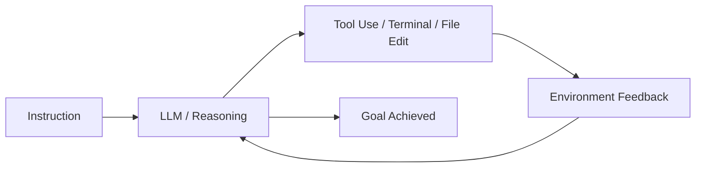

# BK-01: What is an Agent?

> [!NOTE]
> This documentation follows the **PPM V4 Gold Standard**.

## 🔗 1. Source Link
- [Building Effective Agents (Anthropic)](https://www.anthropic.com/research/building-effective-agents)
- [Agentic Workflows (Andrew Ng)](https://www.deeplearning.ai/the-batch/how-agentic-workflows-could-drive-more-ai-progress-than-even-next-generation-foundation-models/)

## 📖 2. Brief & Detailed Explanation
### Brief
Definisi fundamental tentang apa yang membuat sebuah AI disebut sebagai "Agen".

### Detailed
Sebuah agen bukan sekadar LLM. Agen adalah sistem yang menggunakan LLM sebagai **otak** untuk mengontrol **alat** (tools) dan menjalankan **siklus umpan balik** (feedback loops). Agen memiliki otonomi untuk memutuskan tindakan selanjutnya berdasarkan instruksi tingkat tinggi dan observasi lingkungan (seperti membaca isi file atau output terminal).

## 💡 3. Analogy
LLM adalah seperti **mesin mobil** (kekuatan mentah). Agen adalah **mobil otonom** (mesin + sensor + software kemudi) yang bisa mengantar Anda dari titik A ke titik B tanpa Anda menyentuh pedal gas setiap detik.

## 📊 4. Mermaid Diagram

## ⚙️ 5. Under-the-hood Mechanics
Menjelaskan loop utama: `Perceive -> Reason -> Act -> Observe`. Bagaimana sistem agen mem-parsing output teks LLM menjadi perintah sistem (system calls).

## 🧪 6. Practical Lab
Observasi perilaku agen dalam memecahkan bug di `./examples/02-observing-agents.md`.

## ⚠️ 7. Pitfalls & Anti-Patterns
- **The "Chat" Mindset**: Menganggap agen hanya untuk mengobrol, padahal kekuatannya ada pada eksekusi file.
- **Goal Drift**: Memberikan instruksi yang terlalu luas sehingga agen "tersesat" dalam loop yang tidak produktif.
