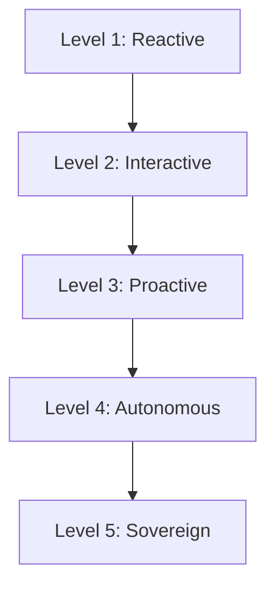

# CH-02: The Autonomy Spectrum

## 📖 1. Understanding Degrees of Freedom
Tidak semua agen diciptakan sama. Kita bisa mengklasifikasikan otonomi agen ke dalam 5 tingkatan (Level 1-5).

## ⚙️ 2. The 5 Levels of Autonomy
1. **Level 1: Passive Assistant** - Hanya merespons jika ditanya (Copilot dasar).
2. **Level 2: Tool-Assisted** - Bisa memanggil tool jika diperintahkan secara spesifik.
3. **Level 3: Conditional Agent** - Bisa memilih tool sendiri untuk tugas sederhana.
4. **Level 4: Autonomous Worker** - Bisa menyelesaikan tugas multi-step tanpa intervensi manusia (Devin/Composer).
5. **Level 5: Self-Evolving Agent** - Bisa merancang tool-nya sendiri dan memperbaiki SOP-nya sendiri.

## 📊 3. Visual Representation

## ⚠️ 4. The Human-in-the-Loop (HITL)
Semakin tinggi level otonomi, semakin besar risiko **Drift** (penyimpangan dari tujuan awal). Penggunaan RAK-02 (Sacred Law) sangat vital untuk menjaga Level 4 & 5 agar tetap dalam kendali manusia.
