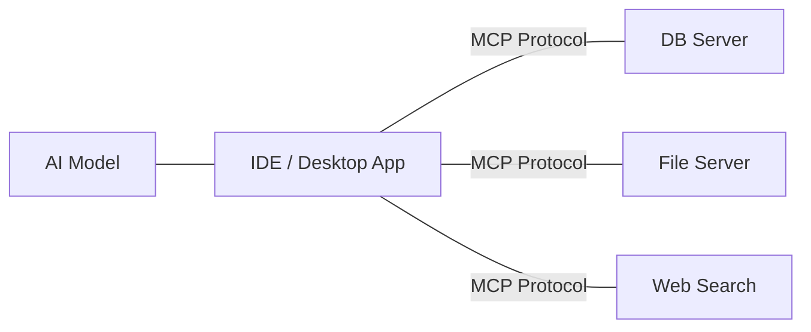

# CH-01: MCP Protocol

## 📖 1. The Universal Bridge
**Model Context Protocol (MCP)** adalah standar terbuka yang memungkinkan AI berkomunikasi dengan sumber data dan tool eksternal secara aman dan terstandarisasi.

## ⚙️ 2. How MCP Works
- **Host**: Aplikasi yang menjalankan AI (misal: Cursor/Windsurf).
- **Server**: Layanan yang menyediakan data/tool (misal: Google Drive, GitHub, Database).
- **Client**: Jembatan yang menghubungkan Host ke Server.

## 📊 3. Connectivity Diagram

## 🧪 4. Practical Implementation
Dalam Cursor, MCP memungkinkan AI untuk melakukan `@search` secara lebih akurat karena ia bisa mengakses indeks yang jauh lebih luas daripada sekadar file lokal.
