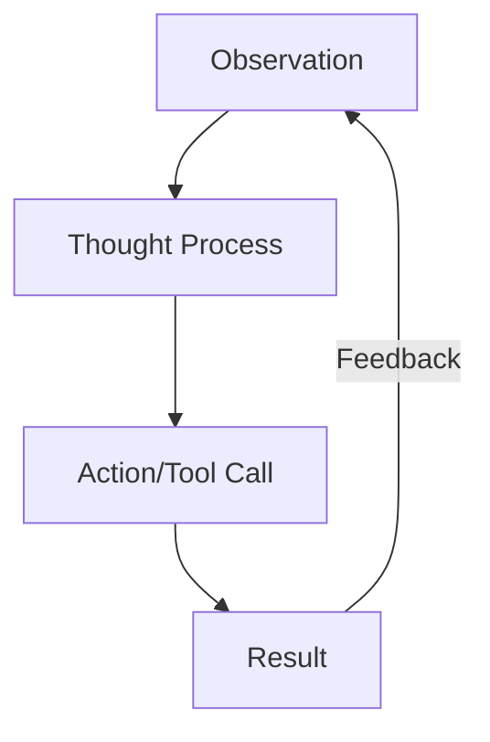

# CH-02: Decision-Making Loop

## 📖 1. The Reasoning Cycle
Bagaimana AI menentukan langkah selanjutnya? Ia mengikuti pola **ReAct** (Reasoning and Acting).

## ⚙️ 2. The Loop Phases
1. **Observation**: Membaca input dan state saat ini.
2. **Thought**: Menalar apa yang kurang untuk mencapai tujuan.
3. **Action**: Memilih tool/perintah untuk dijalankan.
4. **Result**: Menerima output dari tool dan menjadikannya observasi baru.

## 📊 3. Flow Design

## ⚠️ 4. Reasoning Gaps
AI bisa terjebak dalam **Hallucination Loops** jika ia terus menerus menalar berdasarkan data yang salah. Inilah mengapa audit manual (RAK-07) sangat penting setelah loop selesai.
