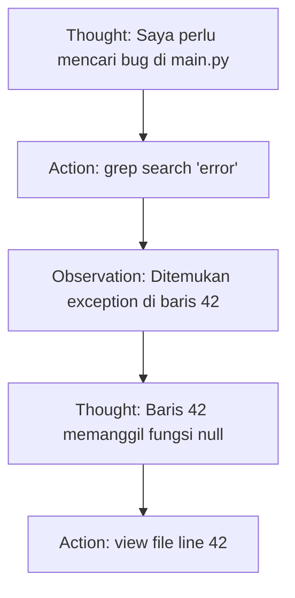

# BK-02: Tool Use and Reasoning

> [!NOTE]
> This documentation follows the **PPM V4 Gold Standard**.

## 🔗 1. Source Link
- [Function Calling in LLMs](https://platform.openai.com/docs/guides/function-calling)
- [ReAct: Synergizing Reasoning and Acting in Language Models](https://arxiv.org/abs/2210.03629)

## 📖 2. Brief & Detailed Explanation
### Brief
Bagaimana AI "menggenggam" alat dan berpikir secara sistematis sebelum bertindak.

### Detailed
Membahas teknik **Function Calling** dan pola **ReAct (Reason + Act)**. AI diajarkan untuk merumuskan pemikiran (Thought) terlebih dahulu, lalu memilih alat (Action), mengamati hasil (Observation), dan menyempurnakan langkah berikutnya. Ini adalah kunci dari stabilitas agen dalam mengerjakan tugas koding yang panjang.

## 📐 9. Chapter List
1. [CH-01: MCP Protocol](./CH-01-MCP-Protocol.md)
2. [CH-02: Decision-Making Loop](./CH-02-Decision-Making-Loop.md)

## 💡 3. Analogy
Seorang koki (Agen) yang membaca resep (Reasoning), lalu menggunakan pisau dan kompor (Tools) untuk memasak. Ia tidak langsung memasukkan semua bahan ke panci, tapi mencicipi (Observation) dan menyesuaikan bumbu secara bertahap.

## 📊 4. Mermaid Diagram

## ⚙️ 5. Under-the-hood Mechanics
Struktur JSON yang digunakan untuk memanggil fungsi dari dalam prompt sistem dan bagaimana model menangani output error dari alat tersebut.

## 🧪 6. Practical Lab
Membedah log pemanggilan fungsi di `./examples/02-tool-logs.md`.

## ⚠️ 7. Pitfalls & Anti-Patterns
- **Tool Hallucination**: AI mencoba memanggil alat yang tidak ada atau dengan argumen yang salah.
- **Reasoning Bypass**: Melakukan aksi tanpa memberikan penjelasan logis (Thought) terlebih dahulu.
