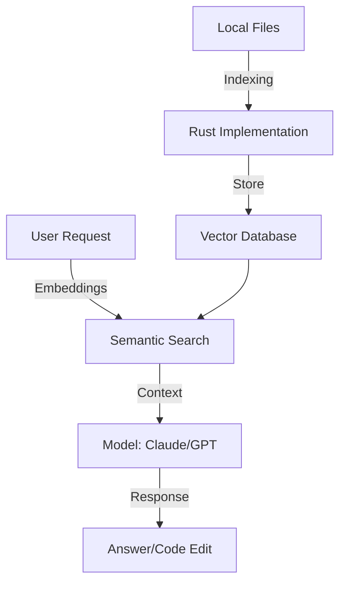

# BK-01: Cursor Internal Anatomy

> [!NOTE]
> This documentation follows the **PPM V4 Gold Standard**.

## 🔗 1. Source Link
- [Cursor Blog: How it works](https://cursor.com/blog)
- [VS Code Extension API (Foundation)](https://code.visualstudio.com/api)

## 📖 2. Brief & Detailed Explanation
### Brief
Membedah arsitektur internal Cursor: Dari Indexing hingga Model Orchestration.

### Detailed
Cursor bukan sekadar fork VS Code. Ia memiliki **Custom Indexer** berbasis Rust yang berjalan di background untuk memetakan repositori Anda ke dalam **Vector Database**. Saat Anda bertanya, Cursor melakukan **Semantic Search** untuk menarik potongan kode paling relevan (Context Retrieval) dan menyajikannya ke LLM dalam jendela konteks yang optimal.

## 💡 3. Analogy
VS Code adalah perpustakaan besar dengan jutaan buku. Cursor adalah perpustakaan yang sama namun dilengkapi dengan **pustakawan super (Indexer)** yang sudah membaca semua buku dan tahu persis di rak mana informasi yang Anda cari berada.

## 📊 4. Mermaid Diagram

## ⚙️ 5. Under-the-hood Mechanics
Analisis tentang `.cursorrules` (System Prompt Injection), `.cursorignore` (Filtering logic), dan bagaimana *streaming edits* (UI overlay) dilakukan pada editor.

## 🧪 6. Practical Lab
Melihat performa indexing pada repo besar di `./examples/03-indexing-benchmark.md`.

## ⚠️ 7. Pitfalls & Anti-Patterns
- **Outdated Index**: Bekerja pada file yang belum terindeks sempurna sehingga AI memberikan saran usang.
- **Context Pollution**: Memasukkan terlalu banyak file ke dalam modal @files sehingga prompt menjadi membingungkan bagi AI.
