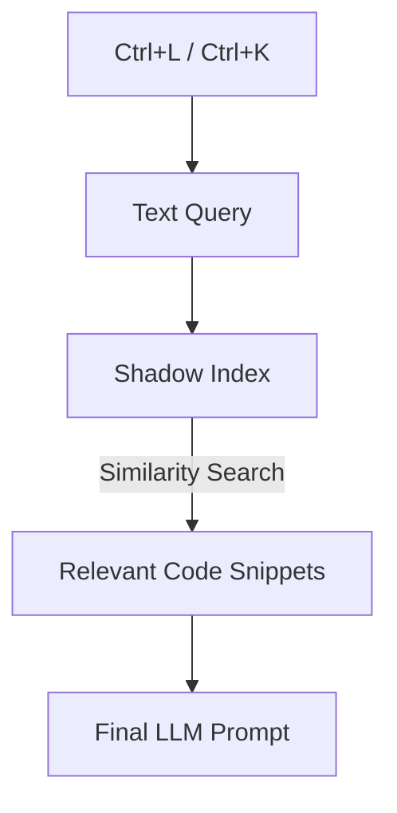

# CH-01: The Shadow Context

## 📖 1. What is Shadow Context?
Pernahkah Anda bertanya mengapa Cursor tahu file yang bahkan tidak Anda buka? Inilah peran **Shadow Context** (Konteks Bayangan).

## ⚙️ 2. Mechanics: The .cursor Folder
Cursor secara otomatis membuat dan mengelola file indeks di dalam folder `.cursor` (biasanya tersembunyi). Folder ini menyimpan:
- **Embeddings**: Representasi numerik dari potongan kode Anda.
- **Reference Graphs**: Hubungan antar fungsi di lintas file.

## 📊 3. Context Retrieval Flow

## ⚠️ 4. Managing Shadow Context
Jangan pernah menghapus folder `.cursor` secara manual kecuali Anda ingin melakukan *Full Re-indexing*. Gunakan `.cursorignore` untuk mengecualikan folder besar yang tidak relevan (seperti `dist` atau `venv`).
