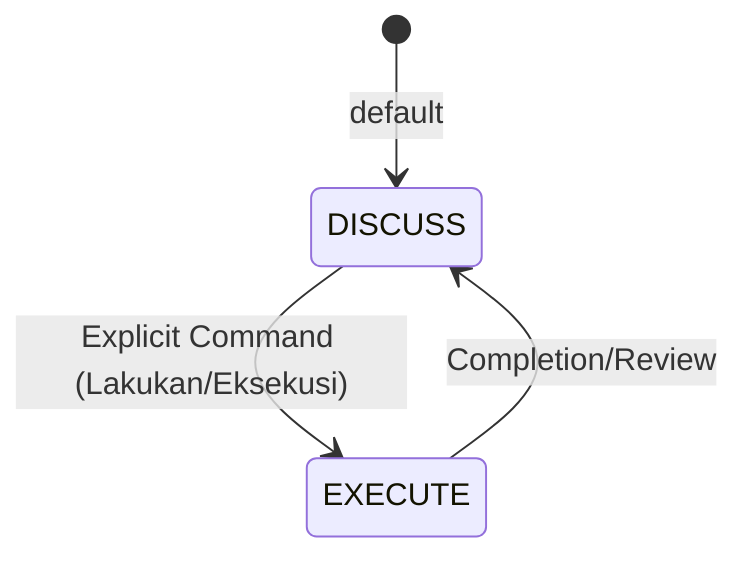

# RAK-02: Foundation & Core Rules

> [!NOTE]
> This documentation follows the **PPM V4 Gold Standard**.

## 🔗 1. Source Link
- [Cursor Rules Documentation](https://docs.cursor.com/custom-instructions/cursorrules)

## 📖 2. Brief & Detailed Explanation
### Brief
Konstitusi dasar dan hukum saklek dalam berinteraksi dengan AI: DISCUSS vs EXECUTE.

### Detailed
Menetapkan fondasi moral dan teknis bagi AI. Bagian ini membahas pentingnya peran Arsitek (User) dalam mengendalikan Pelaksana (AI), serta bagaimana `.cursorrules` digunakan sebagai alat penegakan aturan.

## 💡 3. Analogy
Seperti sistem hukum di sebuah negara; tanpa undang-undang yang jelas (.cursorrules), setiap individu (AI) akan bekerja menurut interpretasi masing-masing, menyebabkan kekacauan arsitektural.

## 📊 4. Mermaid Diagram

## 🏛️ 8. Granular Structure (The Taxonomy)

### [SR-01: Sacred Law](./SR-01-Sacred-Law/)
- [BK-01: Discuss vs Execute](./SR-01-Sacred-Law/BK-01-Discuss-vs-Execute/README.md)
- [BK-02: The Art of Blueprint](./SR-01-Sacred-Law/BK-02-The-Art-of-Blueprint/README.md)

### [SR-02: Prompt Engineering Basics](./SR-02-Prompt-Engineering-Basics/)
- [BK-01: Minimalist Prompting](./SR-02-Prompt-Engineering-Basics/BK-01-Minimalist-Prompting/README.md)
- [BK-02: Role and Persona](./SR-02-Prompt-Engineering-Basics/BK-02-Role-and-Persona/README.md)

---

> [!IMPORTANT]
> **Hukum Utama**: Dilarang melakukan eksekusi tanpa Blueprint yang telah disetujui di fase **DISCUSS**.
