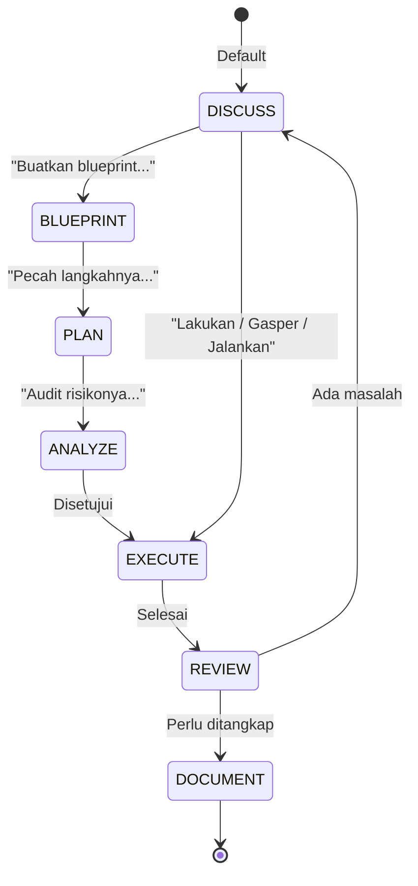

# RAK-02: Foundation & Core Rules - Hukum Dasar Berinteraksi dengan AI

## Gampangnya...

Ini adalah rak fondasi. Kalau rak lain membahas teknik, alat, atau strategi spesifik, rak ini membahas hukum dasarnya: bagaimana kamu dan AI seharusnya bekerja bersama agar hasilnya tidak liar, tidak offside, dan tidak salah arah.

Di sinilah prinsip seperti `DISCUSS before EXECUTE`, pemetaan mode kerja AI, dan cara memilih posisi kerja yang tepat dijadikan aturan dasar yang berlaku ke seluruh repo.

---

## Konteks & Sejarah

Tanpa aturan, AI cenderung mengambil jalan tercepat: langsung menghasilkan output. Masalahnya, output yang cepat tapi salah arah jauh lebih mahal daripada proses yang sedikit lebih lambat namun benar.

Karena itu repo ini membangun fondasi kerja AI di atas dua hal:
- hukum dasar agar AI tidak langsung bertindak tanpa arah yang disetujui,
- sistem mode agar user tahu kapan harus berdiskusi, merancang, menganalisis, mengeksekusi, mengaudit, atau mendokumentasikan.

---

## Cara Kerja

### State Machine Inti



### Dua Fondasi Utama

| Fondasi | Fungsi |
|---|---|
| **SR-01: The Sacred Law** | Menjaga garis batas antara diskusi dan eksekusi |
| **SR-02: AI Interaction Modes** | Menjelaskan mode-mode kerja AI secara inti dan luas |

---

## Kapan Digunakan

RAK ini relevan saat kamu ingin menjawab pertanyaan seperti:
- "Kenapa AI tidak boleh langsung koding?"
- "Apa beda `DISCUSS`, `BLUEPRINT`, `PLAN`, dan `ANALYZE`?"
- "Untuk bikin website baru, saya harus mulai dari mode apa?"
- "Mode yang beredar di internet itu banyak, tapi yang dipakai repo ini yang mana?"

Kalau kamu ingin memahami hukum dasar dan bahasa kerja AI sebelum masuk ke rak-rak yang lebih teknis, mulai dari sini.

---

## Cara Pakai

### Urutan Belajar yang Disarankan

1. Mulai dari `SR-01` untuk memahami hukum dasar `DISCUSS before EXECUTE`.
2. Lanjut ke `SR-02` untuk memahami mode AI secara lebih sistematis.
3. Pakai rak ini sebagai acuan setiap kali kamu bingung harus masuk mode apa.

### Template Dasar

```text
"Saya belum mau coding dulu.
Klasifikasikan dulu task ini:
apakah saya perlu DISCUSS, BLUEPRINT, PLAN, ANALYZE, atau mode lain?
Jelaskan alasanmu."
```

---

## Lab Praktek

**Skenario: membangun fitur baru**

Task: "Tambahkan sistem autentikasi JWT."

Workflow sehat:
1. `DISCUSS` untuk menyamakan tujuan.
2. `BLUEPRINT` untuk menggambar struktur solusi.
3. `PLAN` untuk memecah langkah.
4. `ANALYZE` untuk membaca risiko.
5. `EXECUTE` untuk implementasi.
6. `REVIEW` untuk mengaudit hasil.
7. `DOCUMENT` jika keputusan perlu diwariskan.

---

## Jebakan & Solusi

| Jebakan | Gejala | Solusi |
|---|---|---|
| **Langsung EXECUTE** | AI langsung mengubah file tanpa persetujuan | Pakai `SR-01` sebagai pagar utama |
| **Bingung memilih mode** | Semua task terasa sama | Gunakan `SR-02` sebagai kamus dan decision layer |
| **Mode dicampur dengan workflow** | `Creation` dianggap mode baru | Pisahkan mode dasar dari curator workflow |
| **Terlalu banyak istilah luar** | User bingung antara istilah internet dan sistem repo | Bedakan `core modes` dan `extended modes` |

---

### Sub-Rak & Buku
- **SR-01: The Sacred Law**
  - [BK-01: Discuss vs Execute](./SR-01-The-Sacred-Law/BK-01-Discuss-vs-Execute/README.md)
  - [BK-02: Mental Models](./SR-01-The-Sacred-Law/BK-02-Mental-Models/README.md)
- **SR-02: AI Interaction Modes**
  - [BK-01: Peta Core Modes](./SR-02-AI-Interaction-Modes/BK-01-Peta-Core-Modes/README.md)
  - [BK-02: Extended Modes dari Praktik Internet](./SR-02-AI-Interaction-Modes/BK-02-Extended-Modes-dari-Praktik-Internet/README.md)
  - [BK-03: Kapan Memakai Mode yang Tepat](./SR-02-AI-Interaction-Modes/BK-03-Kapan-Memakai-Mode-yang-Tepat/README.md)
  - [BK-04: Mode vs Curator Workflow](./SR-02-AI-Interaction-Modes/BK-04-Mode-vs-Curator-Workflow/README.md)
  - [BK-05: Living Registry dan Update Protocol](./SR-02-AI-Interaction-Modes/BK-05-Living-Registry-dan-Update-Protocol/README.md)
