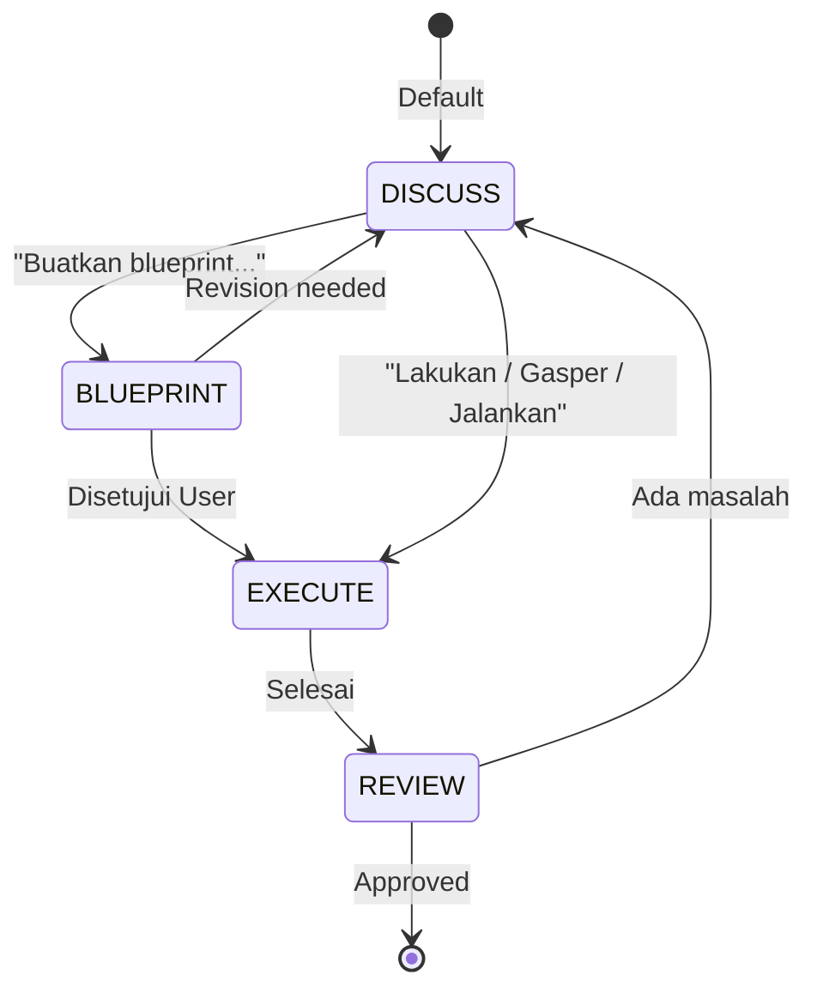

# RAK-02: Foundation & Core Rules — Hukum Dasar Berinteraksi dengan AI

## 🌟 Gampangnya...

Ini adalah aturan paling penting di seluruh perpustakaan ini. Satu hukum utama: **jangan biarkan AI langsung koding tanpa kamu setujui rencananya terlebih dahulu.** Seperti kontraktor bangunan — kamu tidak mau tukang langsung bongkar tembok begitu datang, kan? Kamu ingin lihat gambar arsitektur dulu, setuju, *baru* tukang mulai kerja.

---

## 📖 Konteks & Sejarah

Tanpa aturan, AI akan selalu mengambil jalan pintas: langsung *generate* kode. Ini bukan karena AI jahat, tapi karena secara default AI dilatih untuk *helpful* — dan baginya, "helpful" berarti langsung memberikan output. Masalahnya: output yang cepat tapi salah arah jauh lebih merusak daripada lambat tapi tepat. Dari sinilah lahir konsep **DISCUSS before EXECUTE**.

---

## ⚙️ Cara Kerja

### State Machine Interaksi AI



**Aturan besi**: Selama tidak ada trigger EXECUTE, AI **wajib** tetap di mode DISCUSS/BLUEPRINT. Tidak ada pengecualian.

---

## 🗺️ Kapan Mode Ini Relevan

| Mode | Trigger | Hasil yang Diharapkan |
|---|---|---|
| 🗣️ **DISCUSS** | Default (semua pertanyaan) | AI menjelaskan, menganalisis, bertanya balik |
| 📐 **BLUEPRINT** | "Buatkan blueprint / rancangan..." | AI membuat proposal teknis, **tanpa satu baris kode pun** |
| ⚡ **EXECUTE** | "Lakukan / Gasper / Jalankan / Eksekusi" | AI baru mulai menulis kode |
| 🔍 **REVIEW** | Otomatis setelah EXECUTE selesai | AI melaporkan apa yang dikerjakan dan meminta approval |

---

## 🛠️ Cara Pakai

### Template: Memulai Task Baru (Paling Penting!)

```
"[Deskripsi task]. JANGAN koding dulu. 
 Jelaskan rencanamu dalam 2 kalimat santai."
```

### Template: Menghentikan AI yang Kebablasan

```
"STOP. Kamu melewatkan fase BLUEPRINT. 
 Kembali ke DISCUSS. Jelaskan ulang logika kamu sebelum lanjut."
```

### Template: Memberikan Izin Eksekusi

```
"Baik, rencana sudah oke. Gasper — 
 tapi kerjakan satu file dulu, lapor hasilnya."
```

---

## 🧪 Lab Praktek

**Skenario: AI yang langsung kabur coding**

Kamu ketik: *"Tambahkan fitur login ke proyekku."*
AI langsung mulai generate 200 baris kode.

**Cara handle:**
1. Ketik: *"STOP. Kamu belum dapat izin EXECUTE."*
2. Lanjut: *"Sekarang mode BLUEPRINT. Jelaskan: file mana yang akan diubah, dan mengapa?"*
3. Review blueprint AI. Setuju? Baru ketik: *"Gasper."*

---

## ⚠️ Jebakan & Solusi

| Jebakan | Gejala | Solusi |
|---|---|---|
| **Langsung EXECUTE** | AI langsung koding tanpa bertanya | Tambah ke `.cursorrules`: *"Default mode is DISCUSS. No code without EXECUTE trigger."* |
| **Blueprint palsu** | AI bilang "oke, saya akan..." lalu langsung koding | Bedakan: blueprint = rencana tertulis, bukan narasi verbal |
| **EXECUTE terlalu luas** | Kamu bilang "Gasper" → AI ubah 10 file sekaligus | Selalu batasi: *"Gasper, tapi 1 file dulu."* |

---

### 🗂️ Sub-Rak & Buku
- **SR-01: Sacred Law**
  - BK-01: DISCUSS vs EXECUTE (Hukum Utama)
  - BK-02: The Art of Blueprint (Cara membuat proposal yang baik)
- **SR-02: Prompt Engineering Basics**
  - BK-01: Minimalist Prompting
  - BK-02: Role & Persona Setting
- **SR-03: Blueprint Validation Protocols**
  - BK-01: Multi-Phase Validation
