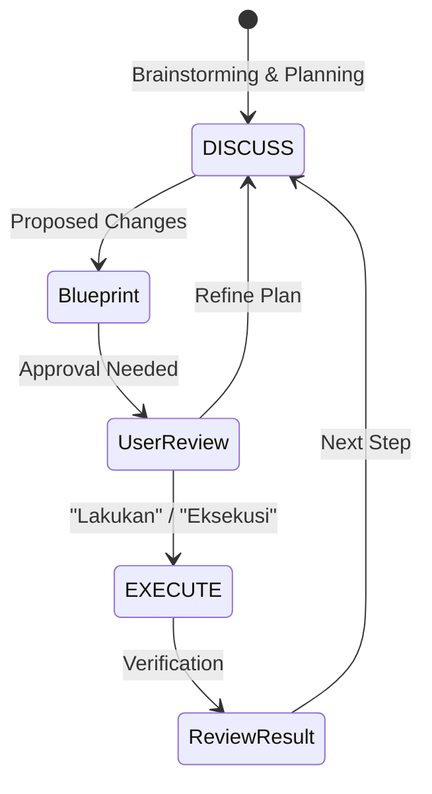

# BK-01: Discuss vs Execute

> [!NOTE]
> This documentation follows the **PPM V4 Gold Standard**.

## 🔗 1. Source Link
- [Human-in-the-loop AI Patterns](https://www.humanloop.com/blog/human-in-the-loop-ai)
- [Managing AI Agents with SOPs](https://www.width.ai/post/managing-ai-agents-with-sops)

## 📖 2. Brief & Detailed Explanation
### Brief
Protokol komunikasi dua fase yang memisahkan antara perencanaan strategis dan eksekusi teknis.

### Detailed
**[DISCUSS] mode** adalah pengaturan default di mana AI berfungsi sebagai analis. AI dilarang mengubah file tanpa izin. Tujuannya adalah untuk menyelaraskan pemahaman konteks. **[EXECUTE] mode** adalah fase di mana AI melakukan penulisan kode setelah strategi disetujui. Pemisahan ini mencegah AI melakukan modifikasi yang merusak (destructive) akibat salah paham.

## 💡 3. Analogy
Membayangkan hubungan antara **Arsitek Utama** (User) dan **Mandor Bangunan** (AI). Mandor tidak boleh mulai mengecor semen sebelum Arsitek menyetujui cetak biru (blueprint) di atas meja diskusi.

## 📊 4. Mermaid Diagram

## ⚙️ 5. Under-the-hood Mechanics
Bagaimana `.cursorrules` secara teknis memberikan instruksi sistem (System Instruction) kepada model untuk membatasi kemampuannya dalam melakukan `write_to_file` sebelum kata kunci tertentu terdeteksi dalam prompt pengguna.

## 🧪 6. Practical Lab
Latihan menahan AI agar tidak langsung menulis kode di `./examples/02-holding-execution.md`.

## ⚠️ 7. Pitfalls & Anti-Patterns
- **The Yes-Man AI**: AI yang langsung "kerjakan" tanpa bertanya detail, sering kali berujung pada bug.
- **Micro-Execution**: Melakukan eksekusi kecil-kecil tanpa rencana besar, menyebabkan inkonsistensi arsitektur.
