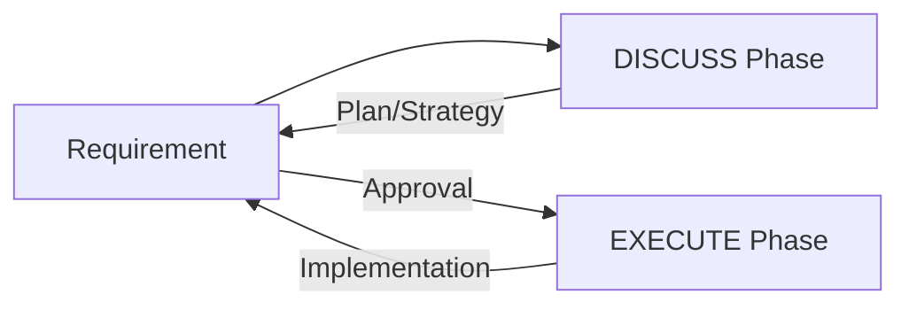

# CH-01: The Mandatory Contract

## 📖 1. The Core Philosophy
Mengapa kita butuh protokol **DISCUSS vs EXECUTE**? Karena AI seringkali terlalu antusias untuk mulai menulis kode sebelum benar-benar memahami batasan arsitektur atau keinginan tersembunyi pengguna.

## ⚙️ 2. The Contract Rule
- **Phase DISCUSS**: Dilarang melakukan perubahan file (`multi_replace_file_content` atau `write_to_file`). Fokus hanya pada klarifikasi, strategi, dan perancangan.
- **Phase EXECUTE**: Dilakukan hanya setelah pengguna memberikan sinyal hijau (misal: "Lakukan", "Gasper", "Jalankan").

## 📊 3. Interaction Loop

## ⚠️ 4. Boundary Breach
Jika agen langsung menulis kode tanpa diskusi, itu dianggap sebagai **Protokol Breach**. Hal ini sering berujung pada penulisan kode di file yang salah atau penghapusan logika penting yang tidak sengaja.
