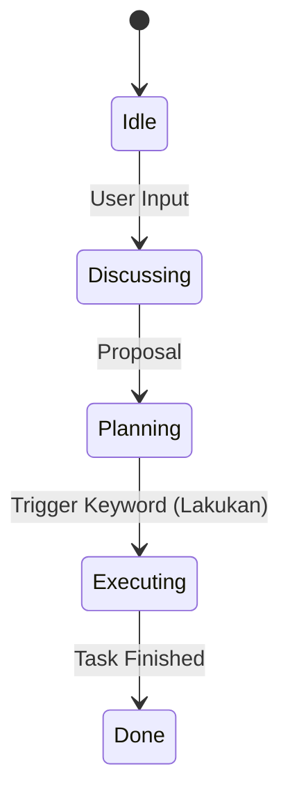

# CH-02: Transition Triggers

## 📖 1. Mastering the Gateway
Bagaimana kita tahu kapan diskusi harus berakhir dan eksekusi harus dimulai? Kita membutuhkan **Trigger Keywords** (Kata Kunci Pemicu).

## ⚙️ 2. Valid Triggers
Daftar kata kunci yang secara resmi mengakhiri fase DISCUSS dalam sistem SOP ini:
1. **"Lakukan"**: Instruksi umum untuk mulai menerapkan rencana.
2. **"Gasper"**: Instruksi cepat untuk eksekusi tanpa perubahan rencana.
3. **"Implementasi sekarang"**: Instruksi formal.
4. **"Fix this"**: Sinyal untuk langsung memperbaiki bug yang sudah didiskusikan.

## 📊 3. Trigger Mechanics

## 🧪 4. Implementation Logic
Trigger ini harus dicatat secara jelas di dalam `.cursorrules` proyek agar AI mengenali bahwa ia telah mendapatkan "izin resmi" untuk memodifikasi sistem.
