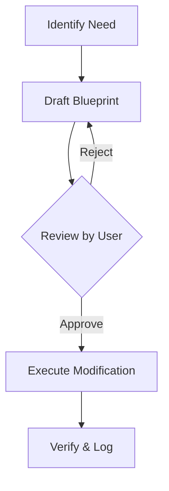

# BK-02: The Art of Blueprint

> [!NOTE]
> This documentation follows the **PPM V4 Gold Standard**.

## 🔗 1. Source Link
- [Drafting Technical Proposals](https://www.atlassian.com/engineering/how-to-write-a-technical-design-document)

## 📖 2. Brief & Detailed Explanation
### Brief
Teknik menyusun proposal perubahan yang komprehensif sebelum menyentuh baris kode pertama.

### Detailed
Sebuah Blueprint harus mencakup: **Goal** (Tujuan), **Proposed Changes** (File apa saja yang berubah), **Verification Plan** (Cara mengetesnya), dan **Potential Risks**. Tanpa blueprint, eksekusi AI menjadi "tebak-tebak buah manggis" yang sangat berisiko pada sistem produksi.

## 💡 3. Analogy
Seperti seorang dokter yang menjelaskan rencana operasi kepada pasien. Dokter tidak langsung membedah, tapi menjelaskan bagian mana yang akan disayat, apa tujuannya, dan apa risikonya.

## 📊 4. Mermaid Diagram

## ⚙️ 5. Under-the-hood Mechanics
Menjelaskan struktur `implementation_plan.md` sebagai artefak transient yang digunakan agen untuk menyimpan state perencanaan sebelum diubah menjadi aksi permanen.

## 🧪 6. Practical Lab
Membuat blueprint untuk refactoring kecil di `./examples/02-creating-blueprint.md`.

## ⚠️ 7. Pitfalls & Anti-Patterns
- **Vague Blueprint**: Blueprint yang hanya berisi "Saya akan perbaiki bug" tanpa detail teknis.
- **Skipping Review**: User langsung menyetujui tanpa membaca detail blueprint.
