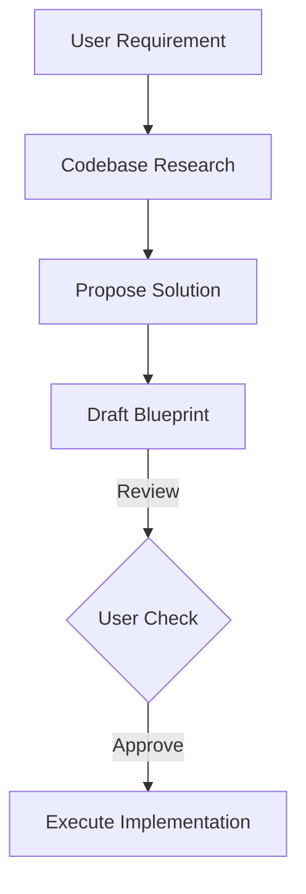

# CH-01: Structural Design First

## 📖 1. The Blueprint Concept
**Blueprint** bukan sekadar rencana, tapi adalah "Peta Jalan" (Roadmap) teknis. Sebelum satu baris koding pun ditulis, struktur file dan relasi antar komponen harus sudah disepakati.

## ⚙️ 2. Anatomy of a Blueprint
Sebuah Blueprint yang baik mengandung:
- **Target Files**: File mana saja yang akan dibuat/dimodifikasi.
- **Logic Flow**: Bagaimana data berpindah dari komponen A ke B.
- **Dependency Map**: Paket atau library apa yang akan digunakan.

## 📊 3. Blueprint Flow

## ⚠️ 4. The "No Blueprint" Anti-Pattern
Mulai koding tanpa blueprint adalah resep bencana. AI akan cenderung membuat file ad-hoc yang tidak konsisten dengan arsitektur global, menyebabkan utang teknis (technical debt) sejak menit pertama.
