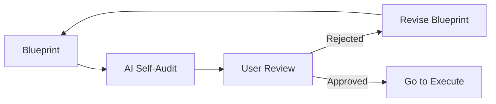

# CH-02: Validation Gates

## 📖 1. The Review Checkpoint
Setelah Blueprint dibuat, ia harus melewati **Validation Gate**. Ini adalah gerbang di mana kesalahan fatal dicegah sebelum masuk ke tahap produksi.

## ⚙️ 2. Validation Checklist
1. **Consistency**: Apakah selaras dengan standar RAK yang ada?
2. **Security**: Apakah ada potensi kebocoran data atau celah keamanan?
3. **Efficiency**: Apakah solusinya paling optimal (tidak over-engineering)?
4. **Traceability**: Apakah setiap perubahan bisa dilacak balik ke kebutuhan pengguna?

## 📊 3. The Audit Process

## 🚀 4. Productivity Impact
Validasi yang ketat di awal menghemat 80% waktu debugging di akhir. Lebih baik menghabiskan 10 menit di fase DISCUSS daripada 2 jam memperbaiki kode yang salah di fase EXECUTE.
