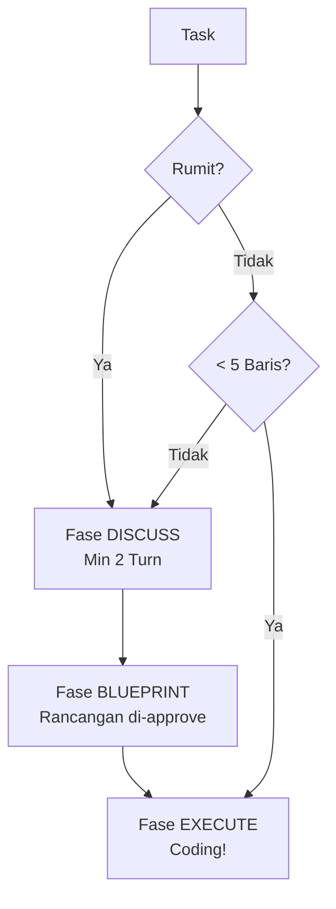

# BK-01: Discuss vs Execute — Memahami Garis Batas Koding

## 🌟 Gampangnya...

Kapan kamu harus ngobrol dulu dengan AI, dan kapan kamu bisa langsung suruh koding? Inilah **Garis Batas**-nya. Jika kamu melompati fase DISCUSS (Diskusi), kamu berisiko dapat kode yang banyak tapi salah arah. Tapi jika kamu DISCUSS melulu untuk hal kecil, pekerjaanmu jadi lambat. Buku ini memberikan rumus emas agar kamu tahu kapan harus berhenti bicara dan kapan harus menekan tombol "Gasper".

---

## 📖 Konteks & Sejarah

Masalah utama AI (terutama model cepat seperti Flash) adalah "Over-Execution". Dia ingin segera membantumu dengan menulis kode, padahal dia belum paham 100% apa yang kamu mau. Sebaliknya, user seringkali malas membuat **Blueprint** karena dianggap membuang waktu. Keseimbangan antara keduanya adalah kunci produktivitas senior engineer di era AI.

---

## ⚙️ Cara Kerja

### The Golden Ratio of Interaction

---

## 🛠️ Cara Pakai

### "The 5-Line Rule" (Aturan 5 Baris)

Agar workflow-mu tidak terasa "lelet" karena birokrasi SOP, gunakan aturan ini:

> [!TIP]
> **BOLEH langsung EXECUTE (Gasper) jika:**
> 1. Perubahan kodenya di bawah **5 baris**.
> 2. Hanya mengganti nama variabel, typo, atau format teks.
> 3. Menambahkan satu baris log/print.
> 
> **WAJIB DISCUSS/BLUEPRINT jika:**
> 1. Menyangkut logika bisnis (if-else, loop).
> 2. Berpengaruh ke database atau file lain.
> 3. Merupakan fitur baru atau refactor folder.

---

## 🧪 Lab Praktek

**Skenario A: Perubahan Kecil (Skip Discuss)**
Prompt: *"Ganti nama variabel `user_name` menjadi `userName` di file ini. Langsung Gasper."*
(Efektif & Cepat).

**Skenario B: Fitur Baru (Wajib Discuss)**
Prompt: *"Tambahkan fitur login."*
AI: *"Saya siapkan blueprint-nya dulu ya..."*
(Mencegah blunder besar).

---

## ⚠️ Jebakan & Solusi

| Jebakan | Gejala | Solusi |
|---|---|---|
| **Under-Governance** | Kamu "Gasper" terus padahal fiturnya susah → Blunder | Ingatkan diri sendiri: Fitur > 5 baris = Blueprint wajib. |
| **Over-Governance** | AI minta blueprint cuma buat ganti warna tombol | Balas: *"Gak usah blueprint, ini tugas sepele. Langsung Gasper."* |
| **Ambiguity** | AI "pikir" itu sepele, padahal menurutmu berat | Gunakan `.cursorrules` untuk mendefinisikan batas area sensitif (seperti: "Folder `/auth` tidak boleh skip blueprint"). |

---

### 📖 Materi Selanjutnya
- [BK-02: Mental Models for AI](../BK-02-Mental-Models/README.md)

