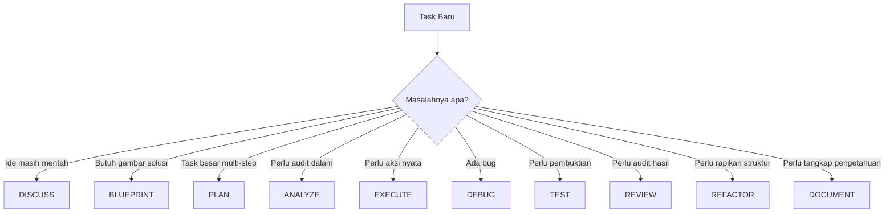

# BK-03: Kapan Memakai Mode yang Tepat

Buku ini adalah panduan keputusan. Fokusnya bukan lagi definisi mode, tetapi pertanyaan praktis: task tertentu sebaiknya masuk mode apa, kapan pindah mode, dan bagaimana menyusun urutan mode yang sehat untuk pekerjaan nyata seperti pembuatan website, bugfix, refactor, dan dokumentasi.

---

## Gampangnya...

Tidak semua task butuh semua mode. Kesalahan paling umum justru terjadi saat user terlalu cepat masuk `EXECUTE`, atau sebaliknya terlalu lama berhenti di `ANALYZE`.

Buku ini membantu kamu memilih mode yang tepat berdasarkan bentuk kerja, bukan berdasarkan feeling.

---

## Konteks & Sejarah

Setelah orang mengenal daftar mode, masalah berikutnya biasanya muncul: "lalu saya pakai yang mana?" Daftar mode tanpa aturan pemakaian akan berubah jadi kamus pasif yang bagus dibaca tapi sulit dipakai.

Karena itu buku ini dibuat sebagai decision layer: mode mana yang primer, mode mana yang pendukung, dan kapan harus berpindah.

---

## Cara Kerja

### Decision Flow Sederhana

### Mode Primer vs Mode Pendukung

| Situasi | Mode Primer | Mode Pendukung Umum |
|---|---|---|
| Ide atau kebutuhan mentah | `DISCUSS` | `ANALYZE` |
| Rancangan fitur baru | `BLUEPRINT` | `PLAN`, `ANALYZE` |
| Task besar | `PLAN` | `BLUEPRINT`, `ANALYZE` |
| Audit risiko atau struktur | `ANALYZE` | `DISCUSS`, `REVIEW` |
| Implementasi | `EXECUTE` | `TEST`, `REVIEW` |
| Bugfix | `DEBUG` | `TEST`, `EXECUTE`, `REVIEW` |
| Pembuktian kualitas | `TEST` | `DEBUG`, `REVIEW` |
| Audit hasil | `REVIEW` | `TEST`, `DOCUMENT` |
| Pembenahan struktur | `REFACTOR` | `ANALYZE`, `TEST`, `REVIEW` |
| Penutupan sesi | `DOCUMENT` | `REVIEW` |

---

## Kapan Digunakan

Pakai buku ini saat kamu bertanya:
- "Saya sedang bikin website baru, urutan mode saya apa?"
- "Saya mau perbaiki bug, apakah perlu blueprint dulu?"
- "Saya bingung kapan harus berhenti diskusi dan mulai execute."
- "Kapan mode tambahan seperti `TEST` atau `DOCUMENT` wajib masuk?"

Ini adalah buku yang paling cocok dibuka saat kamu benar-benar sedang bekerja.

---

## Cara Pakai

### Skenario 1: Membuat Website Baru

Urutan sehat:
`DISCUSS -> BLUEPRINT -> PLAN -> ANALYZE -> EXECUTE -> REVIEW -> DOCUMENT`

Kenapa:
- `DISCUSS` untuk mengunci kebutuhan,
- `BLUEPRINT` untuk menggambar struktur halaman, section, dan flow,
- `PLAN` untuk memecah pembangunan,
- `ANALYZE` untuk membaca risiko desain dan dependency,
- `EXECUTE` untuk implementasi,
- `REVIEW` untuk mengecek hasil,
- `DOCUMENT` untuk mewariskan keputusan.

### Skenario 2: Bug Login atau Error Aneh

Urutan sehat:
`DISCUSS -> ANALYZE -> DEBUG -> TEST -> EXECUTE -> REVIEW`

Kenapa:
- gejala harus jelas dulu,
- konteks teknis harus dibaca,
- akar masalah harus ditelusuri,
- cara reproduksi dan validasi harus ada,
- baru fix diterapkan,
- lalu dicek efek sampingnya.

### Skenario 3: Rapikan Struktur Tanpa Ubah Behavior

Urutan sehat:
`DISCUSS -> ANALYZE -> REFACTOR -> TEST -> REVIEW -> DOCUMENT`

Kenapa:
- tujuan pembenahan harus disepakati,
- struktur kacau perlu dipetakan,
- pembenahan dilakukan dengan batas yang jelas,
- behavior harus dijaga,
- dan perubahan struktur perlu dicatat.

### Skenario 4: Tutup Sesi Kerja

Urutan sehat:
`DISCUSS -> DOCUMENT -> REVIEW`

Atau jika sesi panjang:
`DISCUSS -> ANALYZE -> DOCUMENT -> REVIEW`

### Aturan Pindah Mode

Pindah ke mode berikutnya jika:
- tujuan mode sekarang sudah tercapai,
- kamu sudah punya output yang cukup untuk melangkah,
- atau mode sekarang mulai mengulang hal yang sama tanpa nilai tambah.

Jangan pindah dulu jika:
- requirement masih kabur,
- belum ada keputusan inti,
- atau belum ada bukti minimum untuk melanjutkan.

---

## Lab Praktek

### Quick Table: Task ke Mode

| Task | Mode Utama | Mode Pendukung |
|---|---|---|
| "Bantu saya pahami opsi terbaik" | `DISCUSS` | `ANALYZE` |
| "Rancang struktur fitur ini" | `BLUEPRINT` | `PLAN` |
| "Pecah kerja ini jadi tahapan" | `PLAN` | `BLUEPRINT` |
| "Audit risiko arsitektur ini" | `ANALYZE` | `REVIEW` |
| "Kerjakan perubahan ini" | `EXECUTE` | `TEST`, `REVIEW` |
| "Cari akar bug ini" | `DEBUG` | `TEST` |
| "Buktikan fix ini aman" | `TEST` | `REVIEW` |
| "Rapikan kode ini tanpa ubah perilaku" | `REFACTOR` | `TEST`, `DOCUMENT` |
| "Ringkas hasil kerja hari ini" | `DOCUMENT` | `REVIEW` |

### Prompt Serbaguna

`Task saya adalah [x]. Klasifikasikan mode primer dan mode pendukung yang paling sehat, lalu jelaskan urutan kerjanya.`

---

## Jebakan & Solusi

| Jebakan | Gejala | Solusi |
|---|---|---|
| **Masuk `EXECUTE` terlalu cepat** | Banyak file berubah sebelum arah jelas | Tahan di `DISCUSS`, `BLUEPRINT`, atau `PLAN` lebih dulu |
| **Terlalu lama di `ANALYZE`** | Banyak audit, tidak ada langkah nyata | Tetapkan exit condition untuk analisis |
| **`DEBUG` dipakai untuk task baru** | AI sibuk cari bug pada sesuatu yang belum ada | Balik ke `BLUEPRINT` atau `PLAN` |
| **`REVIEW` dilewati** | Hasil terasa selesai tapi tidak pernah diaudit | Jadikan `REVIEW` penutup default setelah `EXECUTE` |
| **`DOCUMENT` dianggap opsional** | Sesi berikutnya kehilangan konteks | Tutup task besar dengan dokumentasi minimum |
