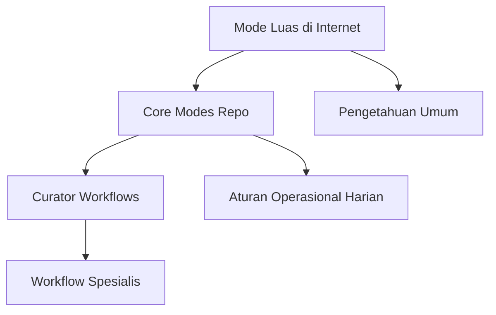

# SR-02: AI Interaction Modes

Sub-rak ini adalah kamus kerja untuk memahami mode interaksi AI secara lebih luas. Di sini kita membedakan antara mode inti yang dipakai resmi di repo ini, mode tambahan yang banyak beredar di praktik internet modern, dan workflow kurator yang sebenarnya merupakan rangkaian beberapa mode sekaligus.

> Status per 2026-03-28.
> Daftar mode di sub-rak ini bersifat living system. Mode inti repo bisa stabil, sementara mode luas dari internet bisa bertambah, menyempit, atau berganti istilah.

---

## Gampangnya...

Kalau AI itu seperti teknisi, maka mode adalah posisi kerja yang sedang ia pakai. Kadang ia sedang ngobrol dan merumuskan arah, kadang sedang menggambar rancangan, kadang sedang mengaudit, dan kadang sedang benar-benar bekerja di mesin.

Masalahnya, dunia luar tidak punya satu daftar mode resmi yang disepakati semua pihak. Karena itu repo ini memakai dua lapis: `core modes` untuk aturan internal yang rapi, dan `extended modes` untuk pengetahuan yang lebih luas dari praktik agent modern.

---

## Konteks & Sejarah

Di fase awal kolaborasi manusia-AI, banyak user hanya membedakan dua keadaan: "ngobrol" dan "ngoding". Semakin modern agent berkembang, pola kerjanya ikut melebar:
- ada fase klarifikasi,
- ada fase riset dan retrieval,
- ada fase tool use,
- ada fase memory dan handoff,
- ada fase guardrail dan self-correction.

Sumber resmi dari OpenAI, Anthropic, dan Google pada dasarnya menggambarkan pola-pola ini sebagai loop kerja agent, bukan sebagai satu daftar mode universal yang dibakukan. Karena itu sub-rak ini sengaja dibuat sebagai **kamus terkurasi**, bukan sebagai klaim "inilah satu-satunya daftar resmi".

---

## Cara Kerja

### Peta 3 Lapisan

### Tiga Lapisan yang Harus Dibedakan

| Lapisan | Fungsi | Contoh |
|---|---|---|
| **Extended Modes** | Pengetahuan luas dari praktik agent modern | `INTAKE`, `RESEARCH`, `TOOL USE`, `HANDOFF` |
| **Core Modes** | Sistem mode resmi repo | `DISCUSS`, `BLUEPRINT`, `PLAN`, `ANALYZE`, `EXECUTE`, dll. |
| **Curator Workflows** | Rangkaian mode untuk jenis kerja tertentu | `Creation`, `Repair`, `Refactor`, `Documentation` |

---

## Kapan Digunakan

Gunakan sub-rak ini saat kamu ingin menjawab pertanyaan seperti:
- "Mode `DISCUSS` itu sebenarnya apa?"
- "Apa bedanya `BLUEPRINT` dan `PLAN`?"
- "Kenapa kadang internet bicara soal `tool use` atau `handoff`, tapi repo ini tidak menaruhnya sebagai mode inti?"
- "Untuk bikin website baru, saya harus mulai dari mode apa?"
- "Kalau nanti saya ingin menambah mode baru untuk kebutuhan proyek saya, apa dasarnya?"

Kalau kebingunganmu bukan lagi pada satu task sempit, melainkan pada **arsitektur cara kerja AI**, mulai dari sub-rak ini.

---

## Cara Pakai

### Urutan Baca yang Disarankan

1. Baca `BK-01` untuk paham 10 mode inti repo.
2. Lanjut ke `BK-03` untuk tahu kapan mode itu dipakai.
3. Lanjut ke `BK-04` agar tidak salah paham antara mode dan kurator.
4. Baru masuk ke `BK-02` untuk memperluas pengetahuan ke praktik internet.
5. Tutup dengan `BK-05` jika kamu ingin menjaga sistem mode ini tetap hidup dan bisa berkembang.

### Aturan Praktis

- Anggap `core modes` sebagai alat resmi yang dipakai repo sehari-hari.
- Anggap `extended modes` sebagai wawasan tambahan, bukan beban yang wajib dipakai semua.
- Jangan membuat mode baru hanya karena ada istilah baru di internet.
- Kalau satu istilah baru ternyata konsisten berguna, baru evaluasi apakah layak dipromosikan jadi mode inti.

---

## Lab Praktek

**Skenario: membangun website baru**

Task: "Saya mau bikin landing page baru dari nol."

Mode yang sehat:
- mulai di `DISCUSS`,
- lanjut ke `BLUEPRINT`,
- pecah di `PLAN`,
- baca risiko di `ANALYZE`,
- baru masuk ke `EXECUTE`,
- tutup dengan `REVIEW`,
- dan kalau perlu akhiri dengan `DOCUMENT`.

**Pelajaran**

Kita tidak perlu mengaktifkan semua istilah mode yang ada di internet. Yang kita perlukan adalah tahu **mode inti apa yang sedang aktif**, dan mode tambahan apa yang hanya berperan sebagai wawasan pendukung.

---

## Jebakan & Solusi

| Jebakan | Gejala | Solusi |
|---|---|---|
| **Mengira semua istilah internet wajib dipakai** | Sistem mode jadi gemuk dan membingungkan | Bedakan `core` vs `extended` |
| **Mencampur mode dengan workflow** | `Creation` dianggap mode baru | Pisahkan mode dasar dari kurator |
| **Tidak paham beda istilah mirip** | Bingung antara `DISCUSS`, `ANALYZE`, `BLUEPRINT`, `PLAN` | Pakai `BK-01` dan `BK-03` sebagai kamus keputusan |
| **Membuat mode baru terlalu cepat** | Repo jadi inkonsisten | Gunakan `BK-05` sebagai gerbang evaluasi |

---

## Buku Utama

- [BK-01: Peta Core Modes](./BK-01-Peta-Core-Modes/README.md)
- [BK-02: Extended Modes dari Praktik Internet](./BK-02-Extended-Modes-dari-Praktik-Internet/README.md)
- [BK-03: Kapan Memakai Mode yang Tepat](./BK-03-Kapan-Memakai-Mode-yang-Tepat/README.md)
- [BK-04: Mode vs Curator Workflow](./BK-04-Mode-vs-Curator-Workflow/README.md)
- [BK-05: Living Registry dan Update Protocol](./BK-05-Living-Registry-dan-Update-Protocol/README.md)
