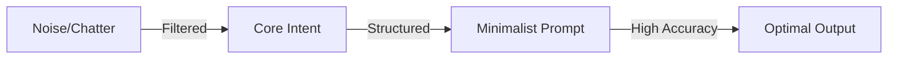

# BK-01: Minimalist Prompting

> [!NOTE]
> This documentation follows the **PPM V4 Gold Standard**.

## 🔗 1. Source Link
- [Prompt Engineering Best Practices (OpenAI)](https://platform.openai.com/docs/guides/prompt-engineering)
- [The Goldilocks Prompt](https://www.promptingguide.ai/introduction/basics)

## 📖 2. Brief & Detailed Explanation
### Brief
Seni memberikan instruksi sesedikit mungkin namun mendapatkan hasil seakurat mungkin.

### Detailed
*Minimalist Prompting* bukan berarti malas, melainkan efisien. Mengurangi *noise* dalam instruksi membantu AI fokus pada logika inti. Ini melibatkan penggunaan kata kerja yang kuat, struktur poin-poin, dan penghindaran basa-basi yang menghabiskan token konteks.

## 💡 3. Analogy
Memberikan instruksi kepada koki: Bukannya berkata "Tolong dong kalau tidak merepotkan buatkan nasi goreng yang enak kayak di hotel", lebih baik berkata "Nasi goreng, pedas sedang, tanpa timun".

## 📊 4. Mermaid Diagram

## ⚙️ 5. Under-the-hood Mechanics
Bagaimana perhatian LLM (Attention Mechanism) terdistribusi. Semakin banyak kata yang tidak relevan, semakin rendah nilai perhatian (attention weight) pada instruksi kritis.

## 🧪 6. Practical Lab
Latihan menyingkat prompt 200 kata menjadi 20 kata tanpa kehilangan makna di `./examples/02-prompt-refining.md`.

## ⚠️ 7. Pitfalls & Anti-Patterns
- **Politeness Overload**: Terlalu banyak kata "Tolong", "Terima kasih", "Berapa harganya" yang mengaburkan instruksi teknis.
- **Wall of Text**: Paragraf panjang tanpa poin-poin yang menyulitkan AI melakukan langkah berurutan.
