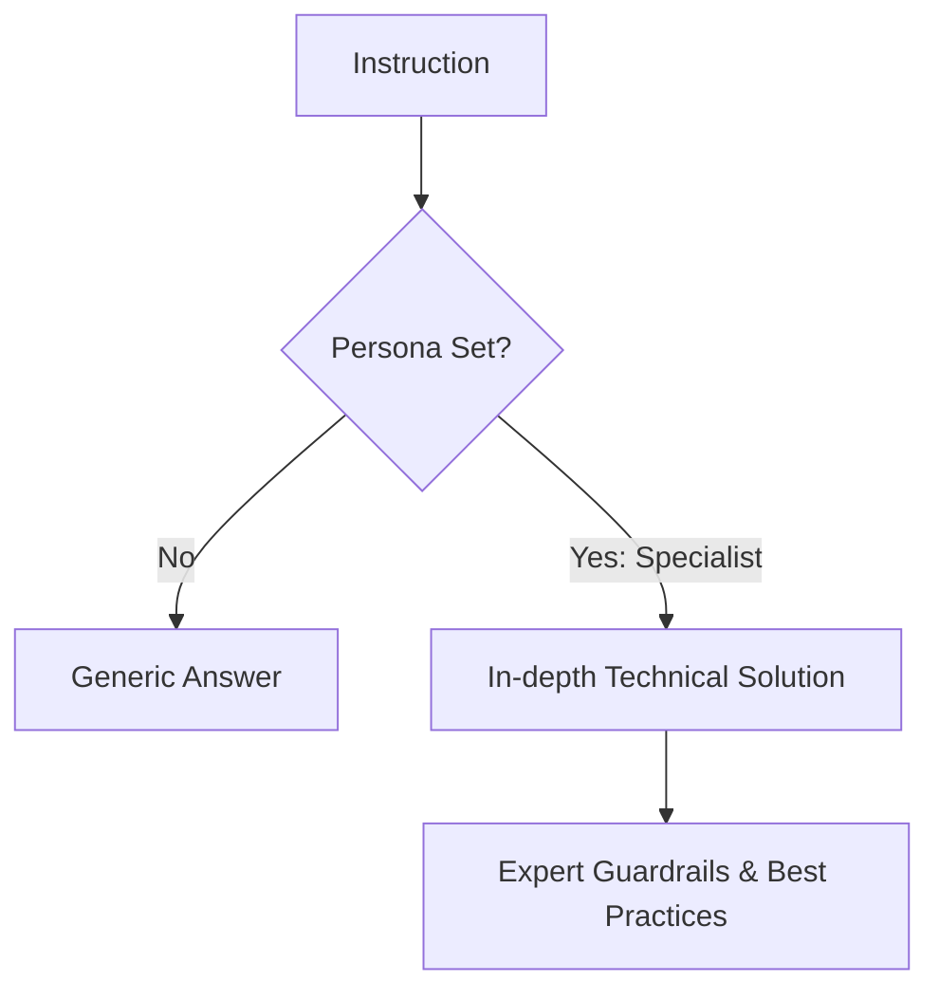

# BK-02: Role and Persona

> [!NOTE]
> This documentation follows the **PPM V4 Gold Standard**.

## 🔗 1. Source Link
- [Persona Pattern in Prompting](https://www.vanderbilt.edu/generative-ai-resource-hub/prompt-engineering/prompt-patterns/persona-pattern/)

## 📖 2. Brief & Detailed Explanation
### Brief
Memberikan "Topeng Keahlian" kepada AI untuk mengubah sudut pandang dan kualitas solusinya.

### Detailed
Tanpa peran, AI akan menjawab secara generic (sebagai asisten serba bisa). Dengan menetapkan peran spesifik seperti **"Senior Rust Security Auditor"**, AI akan mengaktifkan bobot pengetahuan yang lebih spesifik pada domain tersebut, menghasilkan saran yang lebih ketat, teknis, dan berstandar industri.

## 💡 3. Analogy
Jika Anda bertanya tentang rasa sakit di dada kepada orang di jalan, jawabannya akan umum. Jika Anda bertanya kepada seseorang yang Anda definisikan sebagai **"Ahli Jantung Senior"**, diagnosisnya akan sangat spesifik dan dalam.

## 📊 4. Mermaid Diagram

## ⚙️ 5. Under-the-hood Mechanics
Bagaimana pendefinisian peran di awal prompt (System Prompt) mengubah probabilitas distribusi token pada model transformator untuk lebih condong ke terminologi teknis.

## 🧪 6. Practical Lab
Membandingkan jawaban "Generic" vs "Specialist" pada masalah refactoring di `./examples/02-persona-test.md`.

## ⚠️ 7. Pitfalls & Anti-Patterns
- **Conflicting Roles**: Meminta AI menjadi "Ahli Frontend" sekaligus "Ahli Backend" dalam satu instruksi pendek, menyebabkan fokus terbelah.
- **Inconsistent Persona**: Tidak memperbarui persona saat beralih dari fase desain ke fase debugging.
