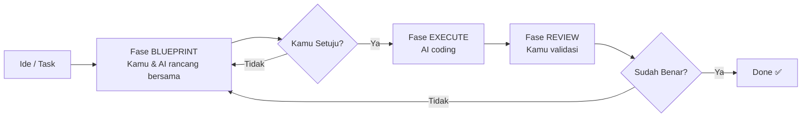

# RAK-03: Evolution & Interfacing — Bagaimana AI dan Kamu Bekerja Sama

## 🌟 Gampangnya...

Rak ini membahas **seni berdialog dengan AI** — khususnya bagaimana cara menyamakan visi antara kamu dan AI sebelum mulai kerja. Kalau RAK-02 adalah "hukumnya", RAK-03 ini adalah "cara praktisnya". Di sini kamu belajar membuat blueprint yang benar, cara menyusun proposal teknis, dan cara mendokumentasikan setiap keputusan agar AI tidak pernah *out-of-context*.

---

## 📖 Konteks & Sejarah

Masalah terbesar dalam kolaborasi human-AI bukan pada kemampuan AI-nya, tapi pada **gap antara visi manusia dan interpretasi AI**. AI hanya tahu apa yang kamu katakan, bukan apa yang kamu maksud. Dari sinilah lahir pendekatan **Blueprint-First**: selalu buat gambar arsitektur dulu, sebelum meminta AI menyentuh satu baris kode pun.

---

## ⚙️ Cara Kerja

### Siklus Kolaborasi Human-AI



**Kunci**: Setiap panah ke kiri (iterasi) itu normal. Jangan terburu-buru maju ke EXECUTE.

---

## 🗺️ Kapan Mode Ini Relevan

| Mode | Kapan Pakai |
|---|---|
| 📐 **BLUEPRINT** | Sebelum memulai task apapun, minta AI draft rencana |
| 📋 **PLAN** | Untuk task besar, minta AI pecah menjadi sub-task |
| 🔍 **REVIEW** | Setelah setiap EXECUTE, review sebelum lanjut |

---

## 🛠️ Cara Pakai

### Template: Meminta Blueprint yang Baik

```
"Saya ingin membuat [fitur X]. Sebelum koding:
 1. Sebutkan file mana saja yang akan terpengaruh
 2. Jelaskan alur logika yang akan kamu buat
 3. Tunjukkan risiko atau trade-off yang kamu lihat
 Jangan koding dulu."
```

### Template: Implementation Log (Mendokumentasikan Keputusan)

Di akhir setiap sesi kerja:
```
"Ringkas semua perubahan yang kita buat hari ini dalam format:
 - File yang diubah: [list]
 - Keputusan arsitektural: [alasan]
 - Yang belum selesai: [daftar]"
```

---

## 🧪 Lab Praktek

**Skenario: Membuat fitur baru tanpa blunder**

1. **Brief**: *"Saya mau tambah autentikasi JWT. Kita BLUEPRINT dulu."*
2. **AI Draft**: AI menjelaskan: file yang diubah, flow token, risiko.
3. **Kamu Review**: *"Flow-nya oke, tapi jangan simpan token di localStorage. Pakai httpOnly cookie."*
4. **Revisi**: AI update blueprint.
5. **Execute**: *"Gasper, mulai dari middleware dulu."*
6. **Log**: *"Ringkas keputusan arsitektural kita hari ini."*

---

## ⚠️ Jebakan & Solusi

| Jebakan | Gejala | Solusi |
|---|---|---|
| **Blueprint verbal** | AI cuma bilang "oke, saya akan buat X" tanpa detail | Minta: "Tulis dalam format bullet: file, logika, risiko" |
| **Lupa context** | Di tengah sesi, AI lupa keputusan awal | Minta AI baca Implementation Log dulu |
| **Iterasi tak berujung** | Blueprint terus direvisi tanpa maju | Tentukan batas: max 2 iterasi blueprint, lalu eksekusi |

---

### 🗂️ Sub-Rak & Buku
- **SR-01: Blueprint-First Approach**
  - BK-01: Cara Membuat Blueprint Efektif
  - BK-02: Template Proposal Teknis
- **SR-02: Implementation Logs**
  - BK-01: Dokumentasi Keputusan Arsitektural
  - BK-02: Handover Notes antar Sesi
