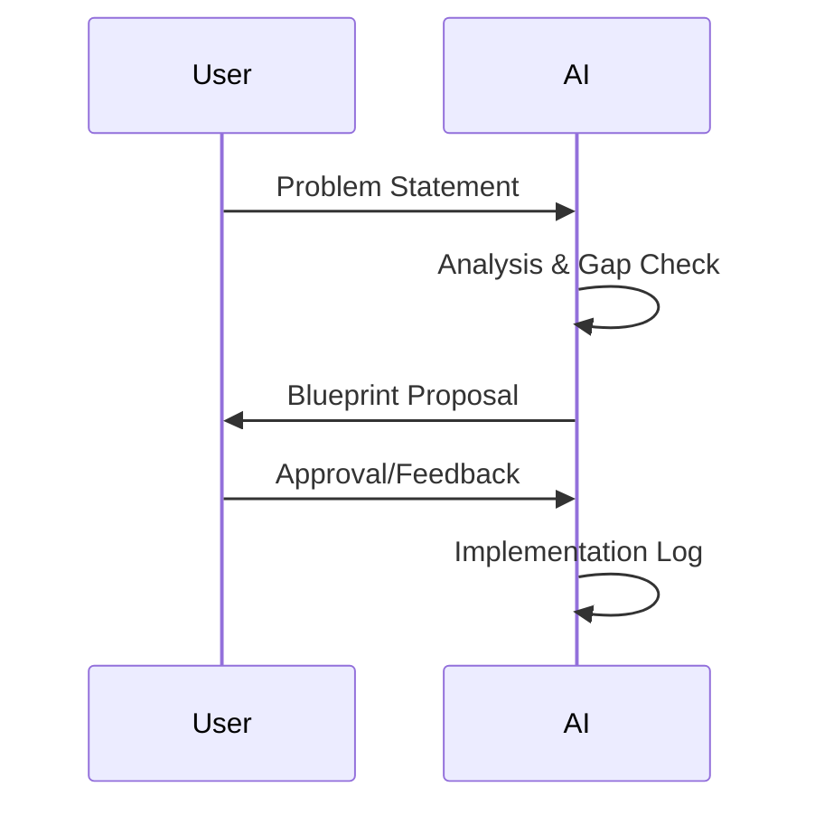

# RAK-03: Evolution & Interfacing

> [!NOTE]
> This documentation follows the **PPM V4 Gold Standard**.

## 🔗 1. Source Link
- [Blueprint-First Development Patterns](https://martinfowler.com/articles/bottlenecks.html)

## 📖 2. Brief & Detailed Explanation
### Brief
Alur kerja evolusioner: Dari Blueprint Konseptual hingga Log Implementasi.

### Detailed
Fokus pada antarmuka antara ide manusia dan kode mesin. Membahas protokol pengajuan proposal (Drafting Proposals) dan pencatatan langkah kerja agar setiap perubahan terdokumentasi dan dapat dilacak.

## 💡 3. Analogy
Seperti arsitek bangunan yang tidak pernah memaku satu papan pun sebelum blueprint biru selesai diperiksa dan disetujui oleh pemilik proyek.

## 📊 4. Mermaid Diagram

## 🏛️ 8. Granular Structure (The Taxonomy)

### [SR-01: Blueprint-First](./SR-01-Blueprint-First/)
- [BK-01: The Power of Blueprint-First](./SR-01-Blueprint-First/BK-01-The-Power-of-Blueprint-First.md)
- [BK-02: Drafting Proposals](./SR-01-Blueprint-First/BK-02-Drafting-Proposals.md)

### [SR-02: Implementation Logs](./SR-02-Implementation-Logs/)
- [BK-01: Logging the Evolution](./SR-02-Implementation-Logs/BK-01-Logging-the-Evolution.md)
- [BK-02: Traceability and Review](./SR-02-Implementation-Logs/BK-02-Traceability-and-Review.md)

---

> [!TIP]
> Evolusi kode bukanlah tentang seberapa cepat Anda berubah, tapi seberapa baik Anda mencatat alasan di balik perubahan tersebut.
