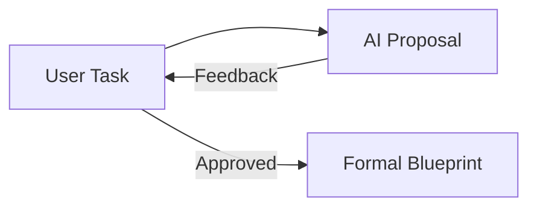

# CH-01: Drafting Proposals

## 📖 1. The Art of the Proposal
Sebelum menyusun Blueprint formal, AI harus mengajukan **Proposal**. Proposal adalah narasi tingkat tinggi tentang *mengapa* sebuah solusi dipilih dan *apa* alternatifnya.

## ⚙️ 2. Proposal Requirements
Sebuah proposal yang baik dalam SOP ini harus mencakup:
1. **Rationale**: Alasan pemilihan pendekatan teknis.
2. **Impact Analysis**: Komponen apa saja yang akan terpengaruh.
3. **Alternative Solutions**: Opsi lain yang sempat dipertimbangkan.

## 📊 3. Logic Flow

## ⚠️ 4. Anti-Patterns
- **The Blind Proposal**: Mengajukan solusi tanpa melakukan riset codebase (`@codebase`) terlebih dahulu.
- **Over-selling**: Hanya menyebutkan kelebihan tanpa menyebutkan risiko atau kekurangan dari solusi tersebut.
