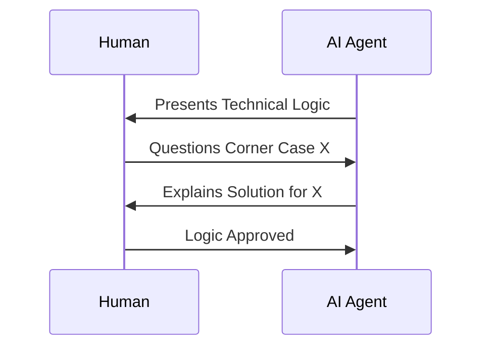

# CH-02: Reviewing Logic

## 📖 1. The Human-AI Logic Check
Setelah proposal disetujui, masuk ke tahap **Logic Review**. Di sini, rincian teknis dibedah untuk memastikan tidak ada celah logika.

## ⚙️ 2. Review Checklist
- **Corner Cases**: Apakah AI sudah memikirkan nilai null, error API, atau timeout?
- **Standard Alignment**: Apakah kodenya akan mengikuti standar penamaan di `@RAK-08`?
- **Performance**: Apakah ada loop yang tidak efisien?

## 📊 3. Interaction Sequence

## 🚀 4. Benefit
Review logika di fase desain mencegah "Logic Bugs" yang sulit dilacak saat kode sudah menyebar ke banyak file.
