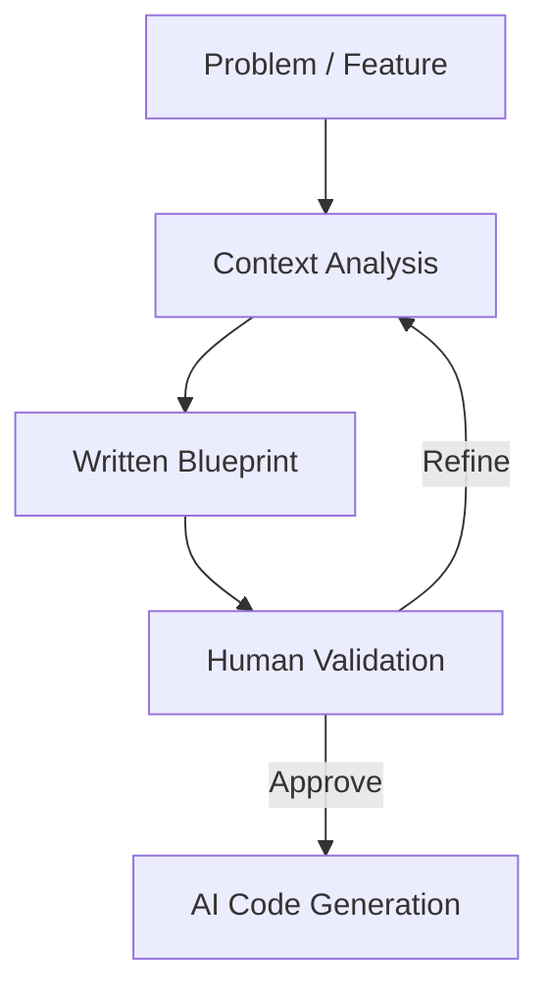

# BK-01: The Power of Blueprint-First

> [!NOTE]
> This documentation follows the **PPM V4 Gold Standard**.

## 🔗 1. Source Link
- [Thinking Before Coding (Software Engineering Institute)](https://insights.sei.cmu.edu/blog/think-before-you-code/)
- [The Importance of Design Docs](https://www.industrialempathy.com/posts/design-docs-at-google/)

## 📖 2. Brief & Detailed Explanation
### Brief
Filosofi utama dalam era AI: Semakin cepat AI bisa mengode, semakin krusial bagi kita untuk berhenti sejenak dan berpikir sebelum memberikan perintah "Enter".

### Detailed
Dalam alur kerja tradisional, hambatan utama adalah kecepatan mengetik kode. Dalam alur kerja AI, hambatan utamanya adalah **kejelasan maksud (Intent Clarity)**. *Blueprint-First* adalah metodologi di mana kita mendefinisikan struktur, ketergantungan, dan logika bisnis secara tekstual sebelum satu baris kode pun ditulis. Ini menjamin bahwa AI tidak "berimprovisasi" di luar koridor arsitektur yang kita inginkan.

## 💡 3. Analogy
Membangun rumah dengan printer 3D raksasa (AI). Printer bisa membangun dinding dalam hitungan menit, tapi jika denahnya (Blueprint) salah, Anda akan mendapatkan rumah yang sangat cepat jadi namun tidak layak huni.

## 📊 4. Mermaid Diagram

## ⚙️ 5. Under-the-hood Mechanics
Menjelaskan bagaimana blueprint bertindak sebagai *Constraint Layer* dalam prompt engineering, mempersempit ruang pencarian (search space) LLM agar tidak melenceng ke solusi yang tidak efisien.

## 📐 9. Chapter List
1. [CH-01: Drafting Proposals](./CH-01-Drafting-Proposals.md)
2. [CH-02: Reviewing Logic](./CH-02-Reviewing-Logic.md)

## 🧪 6. Practical Lab
Perbandingan hasil AI antara "Direct Prompting" vs "Blueprint-First Prompting" di `./examples/03-blueprint-comparison.md`.

## ⚠️ 7. Pitfalls & Anti-Patterns
- **The Speed Trap**: Tergoda untuk langsung mengode karena AI terasa sangat cepat, padahal sedang menuju ke arah yang salah.
- **Micro-Thinking**: Hanya membuat blueprint untuk fungsi kecil, namun melupakan dampak sistemik pada modul lain.
