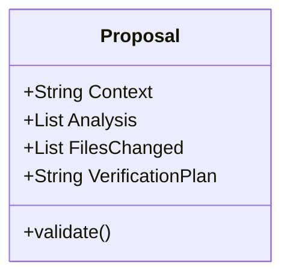

# BK-02: Drafting Proposals

> [!NOTE]
> This documentation follows the **PPM V4 Gold Standard**.

## 🔗 1. Source Link
- [RFC (Request for Comments) Template](https://ietf.org/standards/rfcs/)
- [Writing Good Technical Design Docs](https://medium.com/palo-alto-networks-engineering/writing-technical-design-documents-76f29452b49)

## 📖 2. Brief & Detailed Explanation
### Brief
Cara praktis menulis proposal teknis (blueprint) yang bisa dipahami dengan sempurna oleh AI.

### Detailed
Proposal yang baik harus memiliki struktur yang kaku:
1. **Context**: Mengapa kita melakukan ini?
2. **Analysis**: Apa kondisi saat ini?
3. **Proposed Changes**: Daftar file dan perubahan spesifik.
4. **Verification**: Bagaimana kita tahu ini berhasil?
Dengan struktur ini, AI tidak hanya tahu *apa* yang harus diubah, tapi juga *bagapa* dan *bagaimana* cara memverifikasinya.

## 💡 3. Analogy
Seperti memberikan kartu instruksi kepada asisten dapur: "Potong wortel bentuk dadu 1cm (Action), karena kita akan membuat soup (Context), pastikan tidak ada yang hancur (Constraint)".

## 📊 4. Mermaid Diagram

## ⚙️ 5. Under-the-hood Mechanics
Bagaimana AI menggunakan proposal sebagai "Ground Truth" dalam sesi percakapan (session context) untuk menjaga konsistensi jawaban antar pesan.

## 🧪 6. Practical Lab
Template proposal siap pakai di `./examples/03-proposal-template.md`.

## ⚠️ 7. Pitfalls & Anti-Patterns
- **Hand-Waving**: Menulis proposal yang terlalu abstrak ("Tolong bikin ini bagus").
- **Ignoring Constraints**: Tidak menyebutkan batasan (misal: "Jangan gunakan library eksternal").
