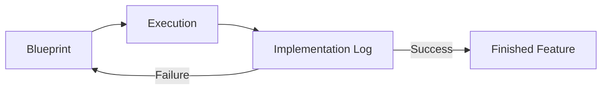

# BK-01: Logging the Evolution

> [!NOTE]
> This documentation follows the **PPM V4 Gold Standard**.

## 🔗 1. Source Link
- [Change logs best practices](https://keepachangelog.com/en/1.0.0/)
- [Documentation as Code](https://www.writethedocs.org/guide/automated-community/docs-as-code/)

## 📖 2. Brief & Detailed Explanation
### Brief
Mencatat setiap langkah evolusi kode yang dilakukan oleh AI Agent.

### Detailed
Dalam pengembangan berbasis agen, perubahan terjadi sangat cepat. Tanpa **Implementation Log**, kita akan kehilangan jejak *kenapa* kode tertentu ada di sana. Log ini bukan sekadar pesan commit Git, melainkan dokumen naratif yang menjelaskan perjalanan dari Blueprint ke hasil akhir, termasuk kegagalan-kegagalan kecil selama proses eksekusi AI.

## 💡 3. Analogy
Seperti kotak hitam (Black Box) pada pesawat. Ia mencatat semua keputusan pilot dan respon mesin, sehingga jika terjadi kecelakaan (bug), kita tahu persis di detik ke berapa dan karena alasan apa kesalahan itu terjadi.

## 📊 4. Mermaid Diagram

## ⚙️ 5. Under-the-hood Mechanics
Bagaimana menyimpan log implementasi secara sistematis menggunakan file Markdown (`walkthrough.md`) yang diperbarui secara inkremental oleh agen.

## 🧪 6. Practical Lab
Cara menulis log implementasi yang efektif di `./examples/03-logging-practice.md`.

## ⚠️ 7. Pitfalls & Anti-Patterns
- **Silent Edits**: Mengizinkan AI mengubah kode tanpa mencatat log apa pun.
- **Post-hoc Justification**: Menulis log di akhir saja tanpa mencatat proses trial-and-error di tengah jalan.
