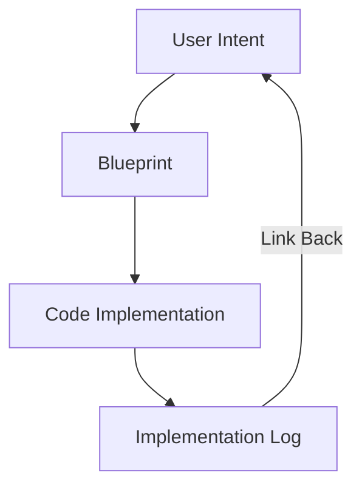

# CH-01: Traceability

## 📖 1. The Audit Trail
**Traceability** adalah kemampuan untuk melacak setiap baris kode kembali ke niat (intent) atau instruksi awal pengguna.

## ⚙️ 2. Logging Policy
Setiap sesi eksekusi besar harus mencatat:
- **Task ID**: Hubungan ke tiket atau goal besar.
- **Modified Nodes**: Daftar fungsi atau file yang berubah.
- **Verification Result**: Apakah tes sudah dijalankan dan lulus?

## 📊 3. Traceability Map

## ⚠️ 4. The "Ghost Edit" Problem
Mengubah kode tanpa mencatat riwayat atau alasan perubahannya. Hal ini membuat pengembang lain (atau AI di sesi berikutnya) bingung mengapa kode tersebut ada di sana.
