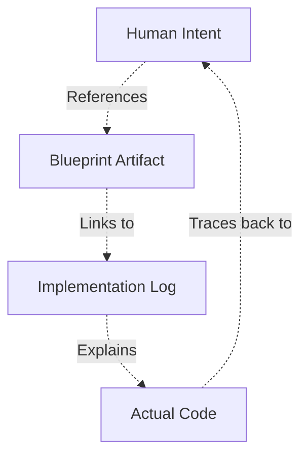

# BK-02: Traceability and Review

> [!NOTE]
> This documentation follows the **PPM V4 Gold Standard**.

## 🔗 1. Source Link
- [Software Traceability (Wikipedia)](https://en.wikipedia.org/wiki/Software_traceability)
- [Reviewing AI-generated code](https://www.codemotion.com/magazine/ai-ml/reviewing-ai-code/)

## 📖 2. Brief & Detailed Explanation
### Brief
Memastikan setiap baris kode yang dihasilkan AI dapat dilacak kembali ke niat (intent) manusia.

### Detailed
**Traceability** adalah jembatan antara kebutuhan bisnis dan baris kode. Dengan SOP ini, kita memastikan setiap perubahan memiliki rantai bukti: `Requirement -> Proposal -> Execution -> Loging -> Verification`. Jika sebuah fungsi bermasalah, kita bisa menarik benang merahnya kembali ke asal usulnya dengan mudah melalui dokumen log dan blueprint yang tersimpan.

## 💡 3. Analogy
Sesuai dengan sistem barcode pada produk makanan: Anda bisa tahu di pertanian mana sayuran ini ditanam hanya dengan memindai kodenya. Di kode kita, "pindaian" itu adalah link ke Blueprint dan Log terkait.

## 📊 4. Mermaid Diagram

## ⚙️ 5. Under-the-hood Mechanics
Penggunaan metadata dan tagging di dalam dokumentasi untuk memudahkan pencarian lintas-referensi antara file kode dan file dokumentasi SOP.

## 🧪 6. Practical Lab
Melakukan audit jejak (tracing) pada fitur yang sudah selesai di `./examples/03-audit-run.md`.

## ⚠️ 7. Pitfalls & Anti-Patterns
- **Broken Links**: Dokumentasi yang tidak terhubung dengan file kodenya.
- **Mental Silos**: Merasa cukup dengan kode saja tanpa mempedulikan audit trail dokumentasi.
