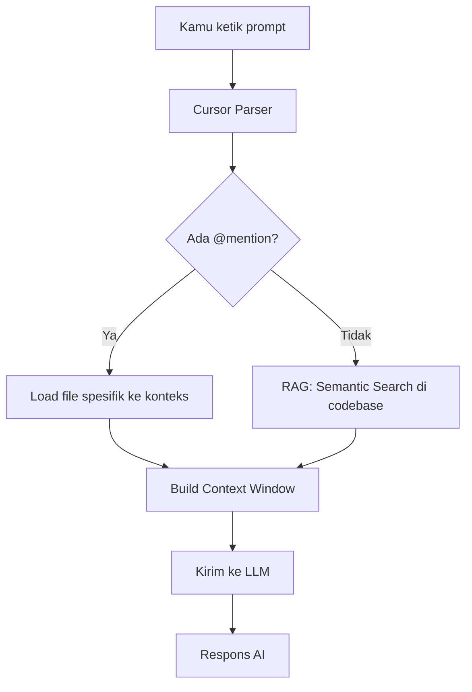

# RAK-04: Core Mechanics & Internals — Dapur Dalam AI Coding

## 🌟 Gampangnya...

Kenapa AI di Cursor tahu koteks proyekmu, padahal kamu tidak paste semua kode-nya? Jawabannya ada di sini. RAK ini membongkar "dapur" di balik AI coding — bagaimana *indexing* bekerja, berapa banyak kode yang bisa AI "ingat" sekaligus, dan kenapa terkadang AI tiba-tiba lupa hal yang sudah kamu bilang sebelumnya. Memahami ini akan membuat kamu jauh lebih efisien dalam memberikan instruksi.

---

## 📖 Konteks & Sejarah

Cursor dan IDE serupa menggunakan kombinasi dua teknologi utama: **LLM** (model bahasa besar) dan **RAG** (Retrieval-Augmented Generation). LLM adalah "otak" yang menjawab, RAG adalah "sistem arsip" yang mengambil kode relevan dari proyekmu sebelum LLM menjawab. Tanpa RAG, AI hanya mengandalkan memori pelatihan — tanpa tau spesifik proyekmu.

---

## ⚙️ Cara Kerja

### Arsitektur Internal Cursor



**Context Window** = Batas memori AI dalam satu sesi. Analoginya: AI sedang membaca di meja kerja — meja hanya muat sekian lembar kertas. Kalau meja penuh, kertas lama terpaksa digeser dan AI "lupa".

| Model | Context Window (estimasi) |
|---|---|
| Gemini 2.5 Pro | ~1 juta token (~750.000 kata) |
| Claude Sonnet | ~200.000 token |
| GPT-4o | ~128.000 token |

---

## 🗺️ Kapan Mode Ini Relevan

| Mode | Kapan Pakai |
|---|---|
| 🔬 **ANALYZE** | "Cek file apa yang AI baca untuk memahami tugasmu" |
| 🗣️ **DISCUSS** | "Kenapa jawabanmu tadi tidak konsisten dengan context sebelumnya?" |
| 📐 **BLUEPRINT** | Saat merancang: pertimbangkan ukuran file agar tidak membebani context |

---

## 🛠️ Cara Pakai

### Memaksimalkan Context Window

```
# Gunakan @mention untuk presisi:
"@src/auth/middleware.ts - review fungsi validateToken ini"

# Daripada: (terlalu luas, AI tebak-tebak)
"review autentikasi di proyekku"
```

### Mengecek Apa yang AI "Baca"

```
"File apa saja yang kamu jadikan referensi untuk menjawab 
 pertanyaan terakhirku? Sebutkan path-nya."
```

### Saat Context Mulai Penuh (Sesi Panjang)

```
"Sebelum kita lanjut, rangkum: apa yang sudah kita kerjakan 
 dan apa keputusan penting yang sudah kita buat?"
```

---

## 🧪 Lab Praktek

**Skenario: AI tiba-tiba "lupa" instruksi sebelumnya**

Ini terjadi karena context window sudah penuh — instruksi awal "terdorong keluar".

**Solusi:**
1. Buat file `session-notes.md` di projekmu
2. Di awal setiap sesi panjang: *"Baca @session-notes.md dulu sebelum kita mulai"*
3. Di akhir sesi: *"Update session-notes.md dengan keputusan hari ini"*

---

## ⚠️ Jebakan & Solusi

| Jebakan | Gejala | Solusi |
|---|---|---|
| **Context overflow** | AI lupa instruksi awal di sesi panjang | Pakai session-notes.md, mulai sesi baru jika perlu |
| **Indexing belum update** | AI tidak tahu file baru yang baru kamu buat | Tunggu indexing selesai (ikon berputar di status bar) |
| **@mention salah path** | AI bilang "file tidak ditemukan" | Cek path dengan benar, gunakan autocomplete `@` |

---

### 🗂️ Sub-Rak & Buku
- **SR-01: The Brain**
  - [BK-01: Token Physics](./SR-01-The-Brain/BK-01-Token-Physics/README.md)
  - [BK-02: Context Management](./SR-01-The-Brain/BK-02-Context-Management/README.md)
- **SR-02: The Archives**
  - [BK-01: How RAG Works](./SR-02-The-Archives/BK-01-How-RAG-Works/README.md)
