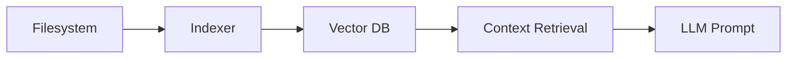

# RAK-04: Core Mechanics & Internals

> [!NOTE]
> This documentation follows the **PPM V4 Gold Standard**.

## 🔗 1. Source Link
- [Cursor Indexing Explained](https://cursor.com/blog/indexing)

## 📖 2. Brief & Detailed Explanation
### Brief
Membedah "Isi Perut" Cursor: Indexing, Context Window, dan Prompt Engineering.

### Detailed
Memahami bagaimana IDE mengelola memori jangka pendek dan panjang. Bagaimana file `.gitignore` mempengaruhi indeks, dan bagaimana memanipulasi jendela konteks agar AI selalu memiliki data yang paling relevan.

## 💡 3. Analogy
Membayangkan AI memiliki meja kerja (Context Window) yang terbatas luasnya. Jika meja penuh dengan sampah, AI tidak punya ruang untuk meletakkan alat yang benar.

## 📊 4. Mermaid Diagram

## 🏛️ 8. Granular Structure (The Taxonomy)

### [SR-01: Indexing & Retrieval](./SR-01-Indexing-and-Retrieval/)
- [BK-01: The Rust Indexer](./SR-01-Indexing-and-Retrieval/BK-01-The-Rust-Indexer.md)
- [BK-02: Vector Embeddings in IDE](./SR-01-Indexing-and-Retrieval/BK-02-Vector-Embeddings-in-IDE.md)

### [SR-02: Context Management](./SR-02-Context-Management/)
- [BK-01: Context Window Limits](./SR-02-Context-Management/BK-01-Context-Window-Limits.md)
- [BK-02: The Art of Context Selection](./SR-02-Context-Management/BK-02-The-Art-of-Context-Selection.md)

---

> [!NOTE]
> Memahami mekanisme ini akan membuat Anda berhenti menyalahkan AI dan mulai mengelola konteks dengan lebih cerdas.
