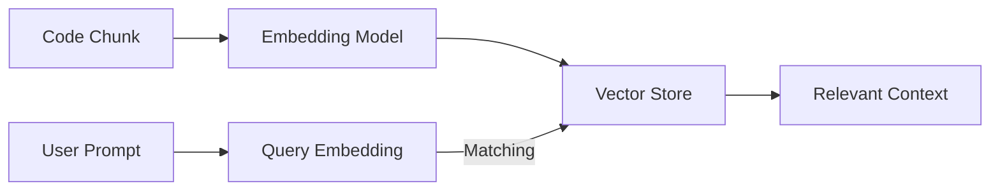

# CH-02: Vector Search

## 📖 1. Beyond Keywords
**Vector Search** memungkinkan AI mencari kode berdasarkan "makna" (semantik), bukan hanya teks yang cocok secara literal.

## ⚙️ 2. Mechanics
- **Embeddings Pipeline**: Potongan kode dikirim ke model (seperti `text-embedding-3-small`) untuk diubah menjadi koordinat angka.
- **Cosine Similarity**: Algoritma untuk mencari "jarak" antara pertanyaan Anda dan koordinat kode di database.

## 📊 3. Vectorization Flow

## 🚀 4. Benefit
Anda bisa mencari "fungsi yang menangani autentikasi" meskipun fungsi tersebut bernama `startSession()` atau `checkToken()`.
