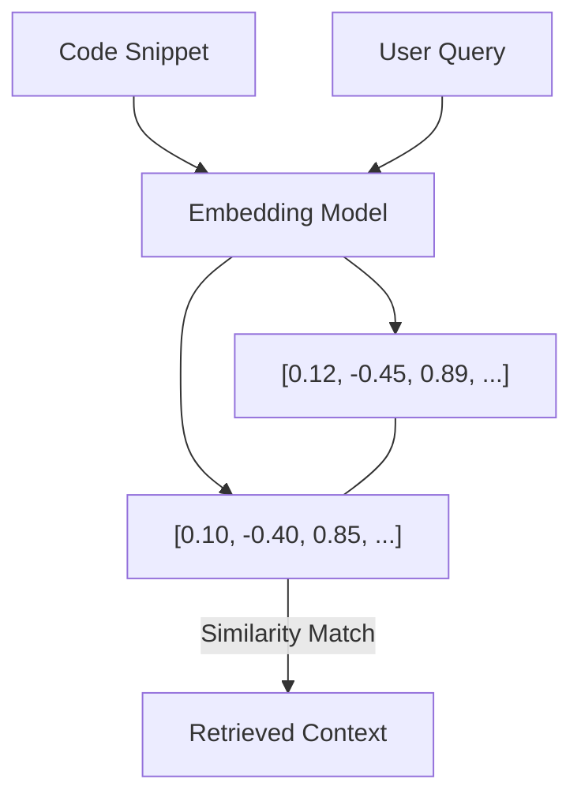

# BK-02: Vector Embeddings in IDE

> [!NOTE]
> This documentation follows the **PPM V4 Gold Standard**.

## 🔗 1. Source Link
- [Text Embeddings Explained (OpenAI)](https://platform.openai.com/docs/guides/embeddings)
- [Vector Databases for Code Highlighting](https://weaviate.io/blog/vector-embeddings-explained)

## 📖 2. Brief & Detailed Explanation
### Brief
Bagaimana kodingan Anda diubah menjadi "Angka" (Vektor) agar AI bisa memahaminya secara semantik.

### Detailed
**Semantic Search** tidak mencari kecocokan kata kunci (keyword matching), melainkan kesamaan makna. Contoh: AI tahu bahwa fungsi untuk "mengambil data user" berhubungan dengan "get_user_info" meskipun kata-katanya tidak sama persis. Hal ini terjadi karena setiap potongan kode diubah menjadi array angka (Vektor) dalam ruang dimensi tinggi. Cursor mencari potongan kode yang memiliki "jarak" (Cosine Similarity) terdekat dengan pertanyaan Anda.

## 💡 3. Analogy
Membayangkan kode Anda adalah **titik-titik di peta bintang**. Kode yang fungsinya mirip (misal: semua fungsi database) akan berkumpul dalam satu **konstelasi** yang sama. AI mencari bintang terdekat dari pertanyaan Anda.

## 📊 4. Mermaid Diagram

## ⚙️ 5. Under-the-hood Mechanics
Teknik **Cosine Similarity** dan bagaimana model embeddings spesifik untuk kode (seperti OpenAI `text-embedding-3-small` atau model lokal) dilatih untuk memahami struktur bahasa pemrograman.

## 🧪 6. Practical Lab
Demonstrasi pencarian semantik (Semantic Search) menggunakan fitur `@codebase` di `./examples/04-semantic-search.md`.

## ⚠️ 7. Pitfalls & Anti-Patterns
- **Poor Naming Conventions**: Nama variabel yang tidak deskriptif (seperti `a`, `b`, `c`) membuat nilai vektor menjadi lemah dan sulit ditemukan lewat pencarian semantik.
- **Over-fragmentation**: File yang terlalu kecil atau potongan kode yang tidak lengkap (tanpa head/context) sulit dipetakan ke dalam vektor yang bermakna.
