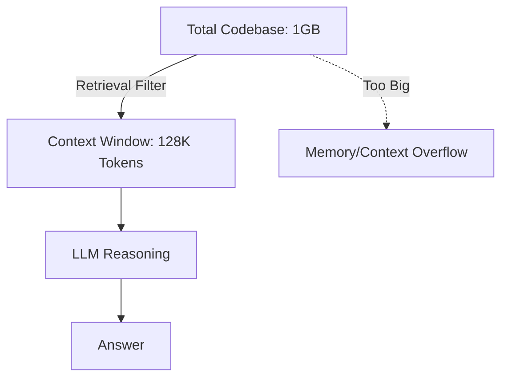

# BK-01: Context Window Limits

> [!NOTE]
> This documentation follows the **PPM V4 Gold Standard**.

## 🔗 1. Source Link
- [Understanding Context Windows](https://www.anthropic.com/news/100k-context-window)
- [Tokenization and Context Constraints](https://help.openai.com/en/articles/4936856-what-are-tokens-and-how-to-count-them)

## 📖 2. Brief & Detailed Explanation
### Brief
Memahami batasan "Memori Jangka Pendek" (Context Window) AI dan mengapa kita tidak bisa memasukkan seluruh repo sekaligus.

### Detailed
Setiap model AI (Claude, GPT-4, dll) memiliki batas **Tokens**. Jika Anda memasukkan terlalu banyak file kodingan, model akan mulai "melupakan" instruksi awal atau memotong bagian akhir kode. Inilah mengapa strategi **Retrieval** (penyeleksian file) sangat penting. Kita harus memastikan hanya informasi yang **paling relevan** yang masuk ke dalam jendela konteks agar AI tetap tajam dan akurat.

## 💡 3. Analogy
Context Window adalah seperti **Meja Kerja**. LLM adalah Pekerja. Meja kerja hanya bisa menampung 5-10 buku (file) sekaligus. Jika Anda menumpuk 100 buku, meja akan berantakan dan pekerja tidak bisa melihat blueprint-nya lagi.

## 📊 4. Mermaid Diagram

## ⚙️ 5. Under-the-hood Mechanics
Cara kerja Tokenizer dalam memecah teks menjadi token dan bagaimana pemakaian token dihitung dalam setiap sesi chat atau composer di Cursor.

## 🧪 6. Practical Lab
Melihat konsumsi token pada chat yang panjang di `./examples/04-token-monitoring.md`.

## ⚠️ 7. Pitfalls & Anti-Patterns
- **Context Spamming**: Menggunakan `@codebase` untuk pertanyaan yang sebenarnya bisa dijawab hanya dengan melihat 1 file.
- **Lost in the Middle**: Masalah di mana LLM memberikan performa buruk pada informasi yang diletakkan di tengah-tengah jendela konteks yang sangat besar.
