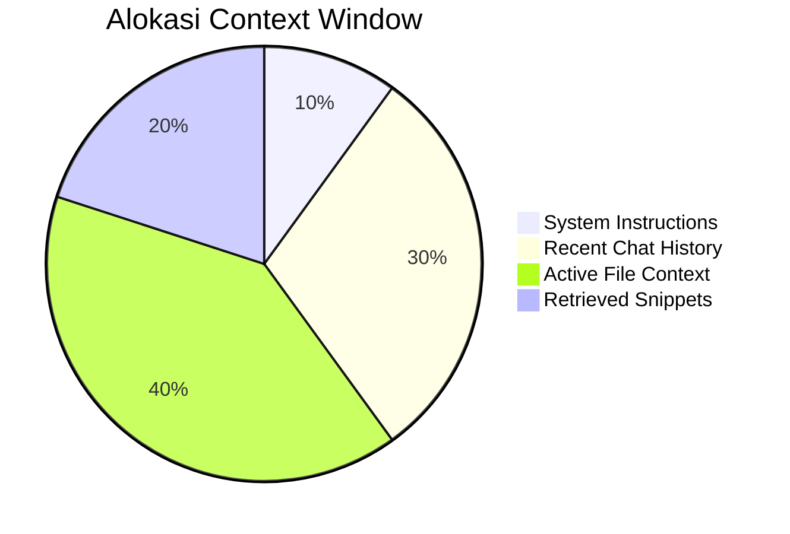

# CH-01: Window Management

## 📖 1. The Context Barrier
Setiap LLM memiliki batas **Context Window** (misal: 128k tokens). Jika kueri Anda melebihi ini, AI akan mulai "melupakan" informasi di awal percakapan.

## ⚙️ 2. Optimization Strategies
- **Token Pruning**: Menghapus baris komentar atau kode yang tidak relevan sebelum dikirim ke AI.
- **Rolling Context**: Mempertahankan 2.000 token terakhir dan 2.000 token awal (instruksi sistem) agar tetap di memori.
- **Selective Pinning**: Memaksa file tertentu (seperti arsitektur inti) untuk selalu ada dalam setiap kueri.

## 📊 3. Token Allocation

## ⚠️ 4. Anti-Patterns
Memberikan seluruh folder `@codebase` untuk tugas kecil. Ini memboroskan token dan meningkatkan kemungkinan halusinasi karena terlalu banyak informasi yang tidak relevan (*Noise*).
