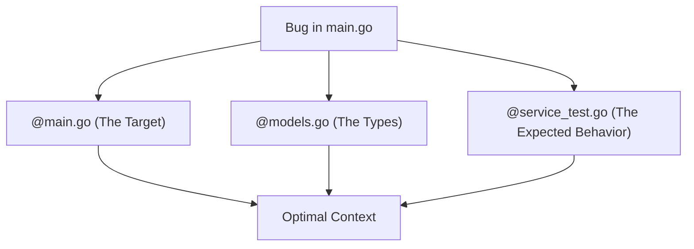

# BK-02: The Art of Context Selection

> [!NOTE]
> This documentation follows the **PPM V4 Gold Standard**.

## 🔗 1. Source Link
- [Pinning Files for Context](https://docs.cursor.com/chat-and-composer/pinning-files)
- [Prompting with Context (Google Cloud)](https://cloud.google.com/vertex-ai/docs/generative-ai/learn/proximal-context)

## 📖 2. Brief & Detailed Explanation
### Brief
Seni memilih file secara manual untuk memberikan "Latar Belakang" terbaik bagi AI.

### Detailed
Meskipun ada `@codebase` yang otomatis, pemilihan manual menggunakan simbol `@` (mentions) sering kali lebih efektif. Anda sebagai arsitek harus tahu file mana yang menjadi "Center of Truth" dari masalah Anda. Prinsipnya: Masukkan **Interface/Definition** (Header files, Types, Interfaces) dan **Example Usage**, bukan cuma kode yang rusak.

## 💡 3. Analogy
Seperti menjadi sutradara film. Anda tidak perlu menunjukkan seluruh skenario ke aktor, cukup berikan **naskah adegan** saat itu dan **latar belakang karakter** agar mereka bisa akting dengan tepat.

## 📊 4. Mermaid Diagram

## ⚙️ 5. Under-the-hood Mechanics
Bagaimana Cursor mengurutkan file yang Anda mention berdasarkan relevansi semantik tambahan sebelum mengirimkan prompt final ke API Model.

## 🧪 6. Practical Lab
Teknik "Context Pinning" yang efektif di `./examples/04-pinning-strategy.md`.

## ⚠️ 7. Pitfalls & Anti-Patterns
- **Missing Dependencies**: Menyuruh AI memperbaiki fungsi tanpa menyertakan file tempat fungsi tersebut dipanggil atau didefinisikan.
- **Redundant Context**: Memasukkan file yang isinya sama berkali-kali lewat cara pemanggilan yang berbeda.
