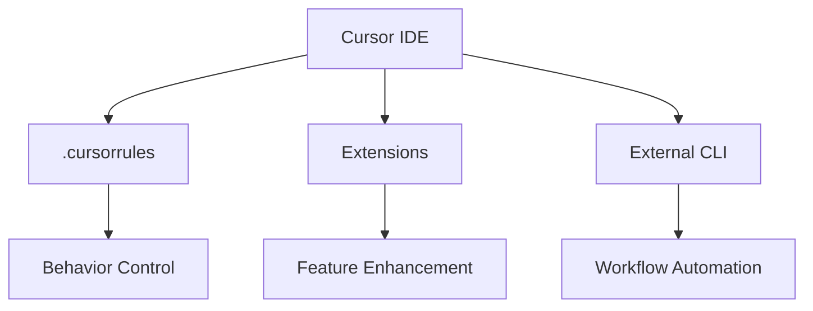

# RAK-05: Ecosystem & Tooling

> [!NOTE]
> This documentation follows the **PPM V4 Gold Standard**.

## 🔗 1. Source Link
- [Cursor Extension Marketplace](https://cursor.com/extensions)
- [CLI for AI Tools](https://github.com/features/copilot/cli)

## 📖 2. Brief & Detailed Explanation
### Brief
Ekosistem pendukung dan konfigurasi `.cursorrules` tingkat lanjut.

### Detailed
Menjelajahi alat-alat pihak ketiga, ekstensi marketplace, dan bagaimana menggunakan CLI untuk mempercepat interaksi dengan AI. Fokus pada kustomisasi lingkungan kerja untuk produktivitas maksimal.

## 💡 3. Analogy
Seperti mekanik balap (Programmer) yang harus memilih ban dan setelan mesin yang tepat (Tools & Config) untuk sirkuit yang berbeda-beda.

## 📊 4. Mermaid Diagram

## 🏛️ 8. Granular Structure (The Taxonomy)

### [SR-01: Cursorrules Tuning](./SR-01-Cursorrules-Tuning/)
- [BK-01: Global vs Project Rules](./SR-01-Cursorrules-Tuning/BK-01-Global-vs-Project-Rules.md)
- [BK-02: Rule Hierarchy and Precedence](./SR-01-Cursorrules-Tuning/BK-02-Rule-Hierarchy-and-Precedence.md)

### [SR-02: External AI Tooling](./SR-02-External-AI-Tooling/)
- [BK-01: CLI for Agentic Workflows](./SR-02-External-AI-Tooling/BK-01-CLI-for-Agentic-Workflows.md)
- [BK-02: Automated Testing Integrations](./SR-02-External-AI-Tooling/BK-02-Automated-Testing-Integrations.md)

---

> [!TIP]
> Alat yang kuat hanya berguna jika penggunanya tahu cara mengonfigurasinya dengan tepat.
