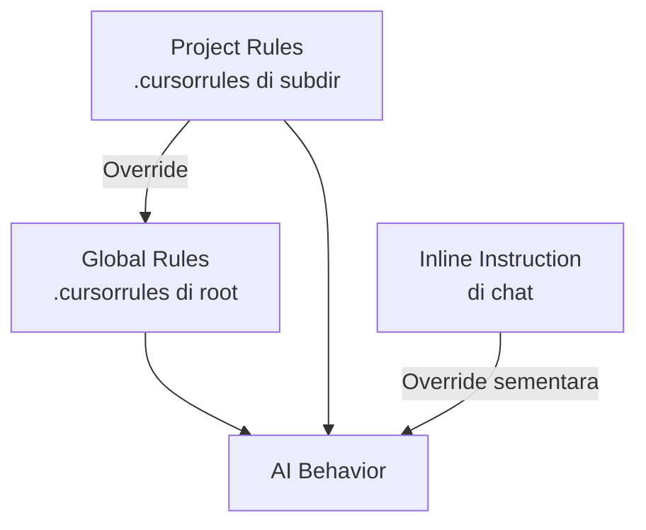

# RAK-05: Ecosystem & Tooling — Mengontrol AI dengan `.cursorrules`

## 🌟 Gampangnya...

`.cursorrules` adalah **remote control** kamu atas AI. Tanpanya, AI berjalan dengan mode default — yang artinya dia akan mengambil jalan pintas, sering "offside" (kebablasan koding tanpa diskusi), dan tidak konsisten antar sesi. Dengan `.cursorrules` yang tepat, AI tahu persis kapan harus berhenti, kapan harus tanya, dan cara kerja seperti apa yang kamu harapkan.

---

## 📖 Konteks & Sejarah

Setiap AI model memiliki perilaku default yang dilatih untuk "helpful as possible" — yang dalam praktiknya berarti langsung memberikan jawaban, bahkan ketika seharusnya bertanya dulu. `.cursorrules` adalah mekanisme untuk **override** perilaku default ini. File ini dibaca AI di awal setiap sesi, sebelum kamu mengetik instruksi apapun.

---

## ⚙️ Cara Kerja

### Hierarki `.cursorrules`



**Urutan prioritas**: Inline > Project-level > Global
Ini berarti: kamu bisa override rules global dengan instruksi langsung di chat, tapi hanya untuk sesi itu.

---

## 🗺️ Kapan Mode Ini Relevan

| Mode | Hubungan dengan `.cursorrules` |
|---|---|
| ♻️ **REFACTOR** | *"Audit `.cursorrules` ini, apakah sudah cukup ketat?"* |
| 🔬 **ANALYZE** | *"Analisis mengapa AI masih sering keluar jalur meskipun ada rules"* |
| 📐 **BLUEPRINT** | Saat mulai proyek baru, blueprint `.cursorrules`-nya dulu |

---

## 🛠️ Cara Pakai

### Template `.cursorrules` Per Tipe Proyek

**Untuk Proyek Web App (Next.js/React):**
```
# Project Rules — [Nama Proyek]

## Mode Default: DISCUSS
Jangan menulis kode sebelum ada perintah eksplisit.
Default mode adalah diskusi dan analisis.

## Stack
- Framework: Next.js 14 (App Router)
- Language: TypeScript

## Anti-Offside Rules
- DILARANG membuat file baru tanpa konfirmasi
- DILARANG mengubah schema database tanpa BLUEPRINT tertulis
- DILARANG menginstall dependency baru tanpa persetujuan

## Protokol Eksekusi
- Sebelum mengubah kode: "Saya akan mengubah [file X] karena [alasan]."
- Setelah selesai: "Saya sudah mengubah [file X]. Silakan review."
```

**Untuk Proyek API (Backend):**
```
# Project Rules — [Nama Proyek API]

## Mode Default: DISCUSS
## Stack: Go / Python / Node.js (sesuaikan)

## Critical Boundaries
- JANGAN ubah endpoint yang sudah ada tanpa BLUEPRINT
- JANGAN hapus field database tanpa migrasi tertulis
- Selalu tulis dokumentasi endpoint setelah EXECUTE
```

### Audit `.cursorrules` yang Ada

```
"Baca .cursorrules ini. Identifikasi: apakah ada celah yang 
 memungkinkan kamu langsung coding tanpa izin saya?"
```

### Anti-Offside Pattern (Kalimat yang Terbukti Efektif)

```
# Di dalam .cursorrules:
"Before writing any code, say: 'Plan: [1 sentence]. Proceed? y/n'"
"If user has not said EXECUTE/Lakukan/Gasper, STOP and DISCUSS."
"After each file edit, report: 'Done: [filename]. Next: [plan]'"
```

---

## 🧪 Lab Praktek

**Skenario: Flash terus "offside" meski sudah ada `.cursorrules`**

Flash memiliki karakter lebih agresif (cepat eksekusi). Rules yang jelas-jelas tertulis pun kadang diloncatinya.

**Solusi bertahap:**
1. Tambahkan kalimat **CAPSLOCK** di rules: `"CRITICAL: DO NOT WRITE CODE without 'Gasper' trigger"`
2. Tambahkan konfirmasi wajib: `"Always repeat back the task in 1 sentence before doing ANYTHING"`
3. Gunakan **few-shot example** di rules:
```
## Contoh Interaksi yang Benar:
User: "Tambahkan fitur X"
AI (BENAR): "Saya pahami kamu mau fitur X. Rencananya: [...]
             Apakah kita lanjut dengan blueprint?"
AI (SALAH): [Langsung menulis kode]
```

---

## ⚠️ Jebakan & Solusi

| Jebakan | Gejala | Solusi |
|---|---|---|
| **Rules terlalu umum** | AI "baca" rules tapi tetap offside | Gunakan kalimat imperatif tegas + CAPSLOCK |
| **Tidak ada boundaries** | AI hapus/ubah file yang tidak diminta | Tambah: "NEVER delete/rename files without explicit confirmation" |
| **Rules tidak diupdate** | Rules lama tidak relevan dengan proyek baru | Audit `.cursorrules` di awal setiap sprint/fase baru |
| **Flash vs Pro gap** | Rules berjalan di Pro tapi tidak di Flash | Sederhanakan rules, Flash lebih responsif ke instruksi pendek & tegas |

---

### 🗂️ Sub-Rak & Buku
- **SR-01: Cursorrules Tuning**
  - BK-01: Global vs Project Rules
  - BK-02: Rule Hierarchy and Precedence
  - BK-03: Anti-Offside Pattern Collection
- **SR-03: Structured Rules Architecture**
  - [BK-01: Blueprint Standar `.cursorrules` Bertingkat](./SR-03-Structured-Rules-Architecture/BK-01-Blueprint-Standar-cursorrules-Bertingkat/README.md)
  - [BK-02: Global Rules vs Local Rules](./SR-03-Structured-Rules-Architecture/BK-02-Global-Rules-vs-Local-Rules/README.md)
  - [BK-03: Artifact Governance di Dalam `.cursorrules`](./SR-03-Structured-Rules-Architecture/BK-03-Artifact-Governance-di-Dalam-cursorrules/README.md)
  - [BK-04: Activation Rules untuk Role Packs dan Review Lenses](./SR-03-Structured-Rules-Architecture/BK-04-Activation-Rules-untuk-Role-Packs-dan-Review-Lenses/README.md)
  - [BK-05: Template `.cursorrules` untuk Project Frontend](./SR-03-Structured-Rules-Architecture/BK-05-Template-cursorrules-untuk-Project-Frontend/README.md)
  - [BK-06: Template `.cursorrules` untuk Project Backend](./SR-03-Structured-Rules-Architecture/BK-06-Template-cursorrules-untuk-Project-Backend/README.md)
  - [BK-07: Template .cursorrules untuk Workspace Gabungan](./SR-03-Structured-Rules-Architecture/BK-07-Template-cursorrules-untuk-Workspace-Gabungan/README.md)
  - [BK-08: Template .cursorrules untuk Project Database](./SR-03-Structured-Rules-Architecture/BK-08-Template-cursorrules-untuk-Project-Database/README.md)
- **SR-02: External AI Tooling**
  - BK-01: CLI for Agentic Workflows
  - BK-02: Automated Testing Integrations


