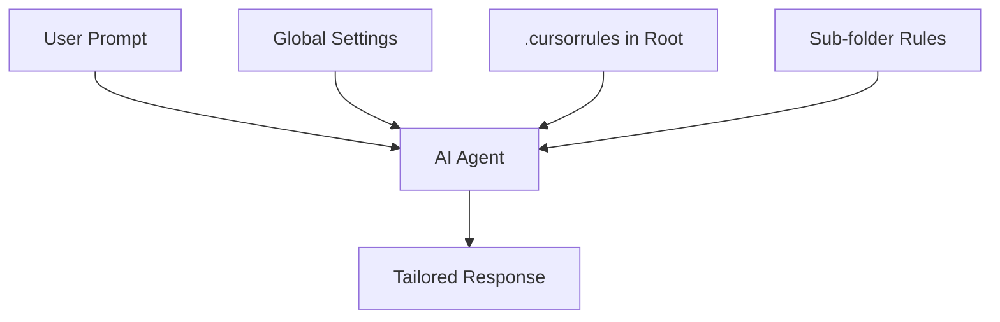

# BK-01: Global vs Project Rules

> [!NOTE]
> This documentation follows the **PPM V4 Gold Standard**.

## 🔗 1. Source Link
- [Customizing Cursor with .cursorrules](https://docs.cursor.com/custom-instructions/cursorrules)
- [Project-specific AI instructions](https://forum.cursor.com/t/how-to-use-cursorrules/1460)

## 📖 2. Brief & Detailed Explanation
### Brief
Memahami perbedaan cakupan antara aturan AI yang berlaku untuk seluruh sistem (Global) dan aturan khusus untuk repositori tertentu (Project-based).

### Detailed
Cursor memungkinkan kita mendefinisikan perilaku AI di dua level. **Global Rules** (biasanya diatur dalam *Settings* IDE) memberikan instruksi umum seperti nada bicara atau bahasa preferensi. **Project Rules** (file `.cursorrules` di root proyek) memberikan instruksi teknis yang sangat spesifik untuk basis kode tersebut, seperti standar coding, library yang digunakan, dan protokol komunikasi (SOP).

## 💡 3. Analogy
**Global Rules** adalah seperti "Etika Umum" di sebuah kantor (misal: harus sopan). **Project Rules** adalah seperti "SOP Spesifik" di lab kimia (misal: harus pakai sarung tangan dan kacamata saat memegang cairan X).

## 📊 4. Mermaid Diagram

## ⚙️ 5. Under-the-hood Mechanics
Menjelaskan bagaimana Cursor menggabungkan (merge) berbagai sumber instruksi ini menjadi satu *System Prompt* raksasa sebelum dikirim ke LLM.

## 🧪 6. Practical Lab
Latihan membuat file `.cursorrules` pertama untuk proyek kecil di `./examples/05-project-rules-setup.md`.

## ⚠️ 7. Pitfalls & Anti-Patterns
- **Rule Bloat**: Memasukkan terlalu banyak aturan global yang sebenarnya tidak relevan untuk semua proyek.
- **Out-of-sync Rules**: Lupa memperbarui `.cursorrules` setelah tim memutuskan untuk pindah ke framework baru.
