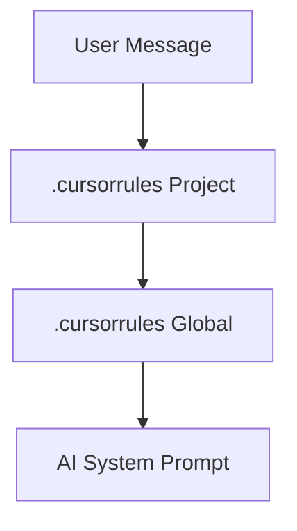

# CH-01: Global vs Local Precedence

## 📖 1. The Rule Hierarchy
Di mana aturan koding harus diletakkan? Cursor mendukung `.cursorrules` di tingkat **Global** (seluruh mesin) dan **Lokal** (per proyek).

## ⚙️ 2. Precedence Order
Aturan di tingkat **Lokal** selalu menimpa (overwrite) aturan di tingkat **Global**. Jika ada konflik instruksi, AI akan memprioritaskan file yang berada di root direktori proyek aktif.

## 📊 3. Layered Rules

## ⚠️ 4. Anti-Patterns
Menaruh aturan yang sangat spesifik untuk proyek (misal: "Gunakan library X") di tingkat Global. Hal ini akan menyebabkan AI salah memberikan saran saat Anda mengerjakan proyek lain yang tidak menggunakan library tersebut.
