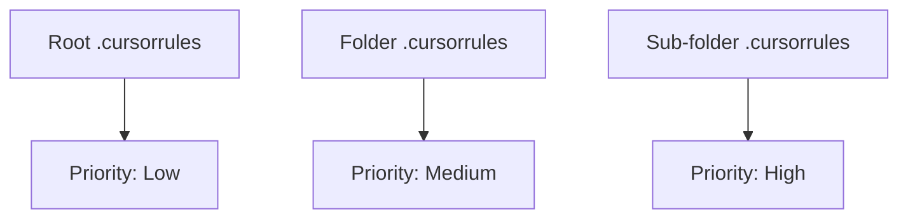

# BK-02: Rule Hierarchy and Precedence

> [!NOTE]
> This documentation follows the **PPM V4 Gold Standard**.

## 🔗 1. Source Link
- [CSS Specificity vs AI Query Precedence](https://developer.mozilla.org/en-US/docs/Web/CSS/Specificity)
- [Overriding AI Instructions](https://learnprompting.org/docs/basics/instruction_following)

## 📖 2. Brief & Detailed Explanation
### Brief
Memahami aturan mana yang menang ketika terjadi bentrokan instruksi antara berbagai level folder.

### Detailed
Dalam struktur yang kompleks, Anda mungkin memiliki `.cursorrules` di root dan aturan tambahan di sub-folder. Prinsip utamanya adalah **Proximity Wins** (Aturan terdekat yang menang). Aturan yang berada di dalam folder yang sedang aktif (current context) akan memiliki prioritas lebih tinggi daripada aturan di folder induknya. Hal ini memungkinkan spesialisasi aturan untuk bagian tertentu dari basis kode (misal: aturan ketat untuk folder `/security` tapi santai untuk folder `/tests`).

## 💡 3. Analogy
Seperti hukum di sebuah negara. Ada Hukum Nasional (Root), tapi ada juga Peraturan Daerah (Local). Jika Anda berada di daerah tertentu, Anda harus mengikuti aturan daerah tersebut terlebih dahulu selama tidak melanggar prinsip dasar nasional.

## 📊 4. Mermaid Diagram

## ⚙️ 5. Under-the-hood Mechanics
Bagaimana pendeteksian jalur file (Path Detection) memicu pemilihan file aturan yang akan disuntikkan ke dalam jendela konteks AI.

## 🧪 6. Practical Lab
Demonstrasi "Rule Overriding" di `./examples/05-precedence-test.md`.

## ⚠️ 7. Pitfalls & Anti-Patterns
- **Conflicting Commands**: Memberikan instruksi "Gunakan Tab" di root tapi "Gunakan Space" di folder, tanpa alasan arsitektural yang jelas.
- **Shadow Rules**: Aturan di sub-folder yang tersembunyi dan tidak terdokumentasi, membuat AI berperilaku aneh bagi anggota tim lain.
